<!-- markdownlint-disable MD013 MD033 -->

# Manual de Operación — Fisiología Vegetal Goiás Verde

> Versión del manual: 1.0 (alineada con la versión 1.x de la aplicación)
> Idioma de referencia: Portugués. Espejos planificados en [`manual.en.md`](manual.en.md) y [`manual.es.md`](manual.es.md).

---

## Índice

1. Presentación
2. Instalación y primera ejecución
3. Cargando sus datos
4. Pipeline de limpieza
5. Filtros globales
6. Análisis Exploratorio (EDA)
7. Regresión bivariada
8. Modelado predictivo
9. Análisis espacial
10. Serie temporal
11. Comparación por grupos
12. Estadística Experimental (diseños)
13. Glosario estadístico
14. Solución de problemas (FAQ)
15. Referencias
16. Contribuyendo

---

## 1. Presentación

### 1.1 Para quién es este manual

Este manual está dirigido a **investigadores, estudiantes de posgrado y técnicos de campo** que van a usar la aplicación *Fisiología Vegetal — Goiás Verde* para analizar datos ecofisiológicos recolectados en campo (mediciones de IRGA, clorofilómetro, ceptómetro, etc.). No presupone experiencia previa con Streamlit ni con programación en Python; presupone familiaridad básica con los términos de la fisiología vegetal (`A`, `gs`, `Ci`, IAF, Clorofila a/b).

### 1.2 Qué hace la aplicación

En una frase: **valida, limpia, explora y modela** planillas de campo de fisiología vegetal, con soporte adicional para análisis **espaciales** (sobre el municipio de Rio Verde, GO) y **temporales**. El flujo estándar es Carga → Pipeline → EDA → Regresión/Modelado/Espacial/Temporal/Comparativa. Las páginas trabajan sobre el mismo dataset en sesión y respetan los filtros globales aplicados en la barra lateral.

### 1.3 Convenciones tipográficas

* `Rutas/de/archivo` y `códigos` aparecen en `fuente monoespaciada`.
* **Negrita** marca elementos de la interfaz (botones, pestañas, etiquetas de selectores).
* *Cursiva* marca términos técnicos en su primera aparición — todos tienen entrada en el [Glosario](#13-glosario-estadístico).
* `>` marca una instrucción de acción ("> haga clic en **Cargar**").
* Las capturas de pantalla usan el dataset de ejemplo `data/sample/0_Dados_Fisiologia_RIO VERDE.xlsx`.

---

## 2. Instalación y primera ejecución

> **Antes de instalar:** existe una versión alojada en [physioflow.streamlit.app](https://physioflow.streamlit.app/). Si solo quiere probar funcionalidades o compartir con colaboradores sin instalar nada, solicite las credenciales al mantenedor del proyecto y úsela directamente desde el navegador. Las instrucciones de abajo son para quien necesita ejecutar la aplicación **localmente** (desarrollo, datos sensibles o indisponibilidad del despliegue).

### 2.1 Requisitos previos

| Ítem | Mínimo | Recomendado |
|---|---|---|
| Sistema operativo | Linux, macOS o Windows 10+ | macOS / Linux |
| Python | 3.12 | 3.12 o 3.14 |
| Memoria RAM | 4 GB | 8 GB |
| Espacio en disco | 1 GB libre | 2 GB libre |
| Navegador | Chrome o Firefox reciente | cualquiera basado en Chromium |

### 2.2 Instalando el entorno

Desde la carpeta raíz del proyecto, abra una terminal y ejecute:

```bash
# 1) Crear y activar entorno virtual
python -m venv .venv
source .venv/bin/activate          # macOS / Linux
# .venv\Scripts\Activate.ps1       # Windows PowerShell

# 2) Actualizar instaladores e instalar dependencias
pip install -U pip wheel
pip install -r requirements.txt
```

La instalación descarga, entre otras, `streamlit`, `pandas`, `scipy`, `statsmodels`, `scikit-learn`, `esda`, `libpysal`, `geopandas`, `pyproj` y `geobr`. La primera ejecución puede tardar de 30 segundos a 2 minutos mientras Streamlit cachea los recursos.

### 2.3 Ejecutando la aplicación

Con el entorno virtual activado:

```bash
python -m streamlit run app.py
```

La terminal mostrará algo parecido a:

```
You can now view your Streamlit app in your browser.

  Local URL: http://localhost:8501
  Network URL: http://192.168.x.x:8501
```

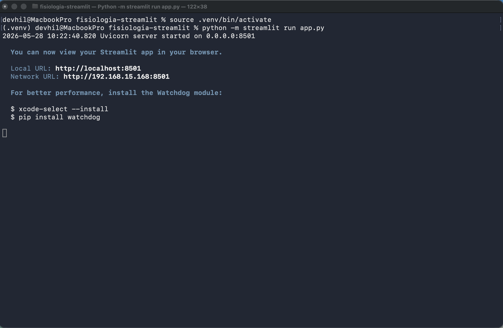

El navegador debe abrirse automáticamente en `http://localhost:8501`. Si no se abre, copie el **Local URL** y péguelo en su navegador.

### 2.4 La primera pantalla

Verá la página **Cargar** cargada, con la barra lateral a la izquierda que contiene:

* logo del **CEAGRE / Goiás Verde**;
* selector de **Idioma** (`Português` / `English` / `Español`);
* menú de navegación con **Cargar**, **Pipeline y Procesamiento**, **EDA**, **Regresión**, **Modelado**, **Análisis Espacial**, **Serie Temporal** y **Comparativa**.

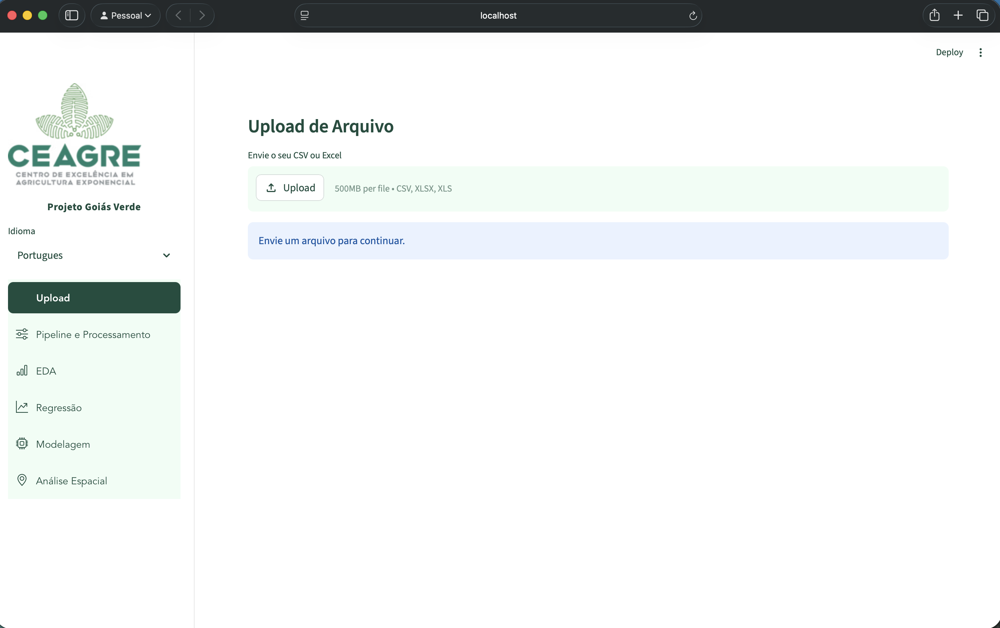

### 2.5 Cambiando el idioma

Use el selector **Idioma** en la parte superior de la barra lateral. El cambio es instantáneo; todas las páginas, etiquetas y mensajes de aviso pasan al idioma elegido. El idioma predeterminado es Portugués.

### 2.6 Inicio de sesión (opcional)

Si el entorno fue configurado con [Supabase](https://supabase.com) (variables `SUPABASE_URL` y `SUPABASE_ANON_KEY` en el archivo `.streamlit/secrets.toml`), la aplicación muestra una pantalla de inicio de sesión antes del menú. Si esas variables no existen, el inicio de sesión se desactiva y la app abre directamente en Cargar — comportamiento estándar para uso local.

---

## 3. Cargando sus datos

### 3.1 Formatos aceptados

| Extensión | Observaciones |
|---|---|
| `.xlsx` | Recomendado. Soporta múltiples hojas — usted elige cuál cargar. |
| `.xls` | Excel heredado, aceptado. |
| `.csv` | Aceptado. Use codificación UTF-8 o Latin-1. |
| `.txt` / `.tsv` | Aceptados. Aparece un **selector de delimitador** (automático, coma, punto y coma, tabulación, espacio). |

Límite por archivo: **500 MB** (límite de Streamlit). Para archivos mayores, divida en hojas.

### 3.2 Perfil de datos (Fisiología / Genérico)

Al cargar, la aplicación resuelve un **perfil de datos**, seleccionable en la propia página de Carga (Automático / Fisiología / Genérico):

* **Fisiología** — el dataset coincide con el esquema de fisiología (ver §3.3): quedan activos la validación de esquema, los valores predeterminados y presets del dominio, y el tratamiento de réplicas.
* **Genérico** — cualquier otro dataset: la interfaz queda neutral (resumen de columnas en lugar del informe de esquema, sin premisas de fisiología, sin réplicas). Es lo que permite usar la plataforma con **cualquier dataset**.

En **Automático** (predeterminado), el perfil se detecta por las columnas presentes; puede forzarlo manualmente cuando lo desee.

### 3.3 Esquema esperado (perfil Fisiología)

La aplicación compara el encabezado de su archivo contra un **esquema de referencia** con tres severidades:

| Severidad | Qué significa | Qué ocurre si falta |
|---|---|---|
| **Obligatoria** | Sin esa columna, el flujo esencial no funciona. | Aviso destacado; el pipeline puede fallar. |
| **Recomendada** | Habilita los análisis estándar (EDA, regresión, modelado). | Aviso medio; análisis específicos quedan vacíos. |
| **Opcional** | Habilita módulos específicos (Espacial, Temporal, réplicas). | Aviso informativo; el módulo correspondiente se deshabilita. |

El diccionario completo de columnas — nombres canónicos, sinónimos aceptados, tipo esperado y módulo dependiente — está en [`docs/data_dictionary.md`](data_dictionary.md). La lista canónica se genera a partir de [`src/schema.py`](../src/schema.py); cada vez que la app se actualiza, ese diccionario refleja la verdad del código.

> **Importante:** la aplicación acepta varias grafías para la misma columna. `Cultura`, `CULTURA` y `Crop_Type` se tratan como el mismo campo; lo mismo vale para `Latitude` / `LATITUDE`, `Data da coleta` / `Data` / `Date`, y así sucesivamente. La columna real del archivo aparece en la columna "Encontrada" del informe de validación.

### 3.4 Cargando el archivo

> Haga clic en **Cargar** > **Browse files**, elija el archivo `.xlsx` y haga clic en **Cargar archivo**.

Si el archivo es un Excel con varias hojas, la app muestra un selector para elegir cuál cargar. Tras la carga, dos métricas aparecen en la parte superior:

* **Filas** — total de registros leídos.
* **Columnas** — total de columnas en el encabezado.

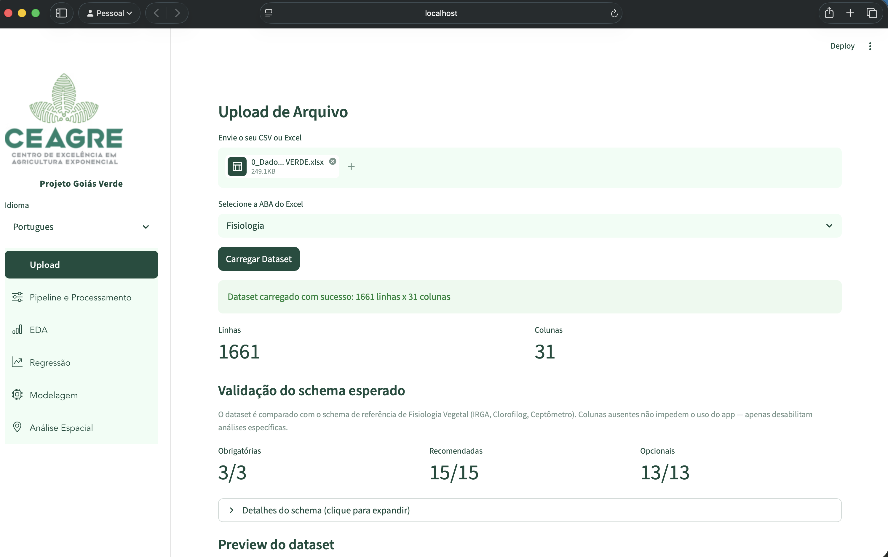

### 3.5 Leyendo el informe de validación

Justo debajo de las métricas aparece el panel **Validación del esquema esperado**, con tres cuadros resumen (obligatorias / recomendadas / opcionales) en el formato `presentes / total`.


#### Avisos comunes y qué hacer

| Mensaje | Diagnóstico | Acción sugerida |
|---|---|---|
| **"Columnas obligatorias ausentes"** | Faltan columnas críticas en el archivo. | Renombre la columna en Excel a uno de los nombres aceptados (ver diccionario); recargue. |
| **"Columnas obligatorias presentes pero 100% vacías"** | La columna existe en el encabezado, pero todas las celdas están vacías. Común con `Manejo` y `Textura`. | Verifique si la columna debería estar rellenada. Si es un dato opcional para su estudio, ignórelo — el pipeline sigue funcionando, pero algunos análisis no considerarán esa variable. |
| **"Latitude fuera del rango [-90, 90]"** | Posible intercambio de Latitud y Longitud, o valores en otra unidad (grados minutos segundos). | Reabra el archivo, compruebe los valores y conviértalos a grados decimales. |
| Columna marcada como **"tipo divergente"** | La columna se encontró pero el contenido no corresponde al tipo esperado (ej.: texto en columna numérica). | Busque celdas con texto, comentarios o caracteres extraños en la columna correspondiente. |

#### Ver la tabla completa

> Haga clic en **Detalles del esquema** para expandir una tabla con cada columna esperada: nombre encontrado, tipo detectado, estado (`presente`, `vacía (100% nula)`, `ausente`, `tipo divergente`) y qué módulo de la app depende de ella.

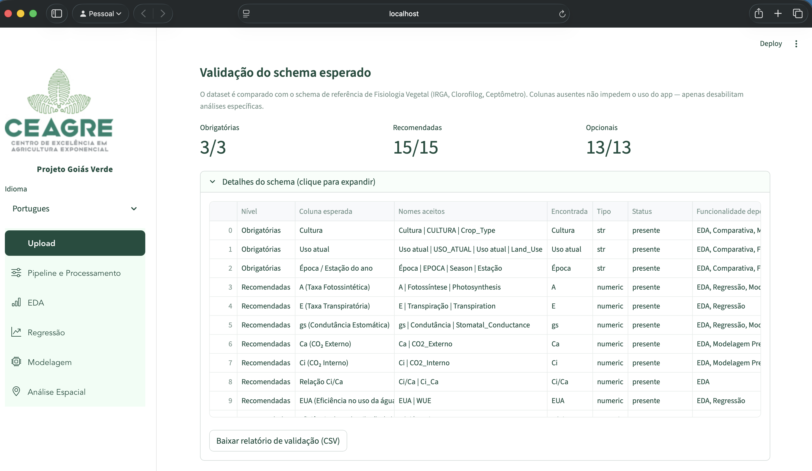

> **Consejo:** hacer clic en el botón **Descargar informe de validación** guarda esa tabla como CSV — útil para enviar a la persona responsable de la planilla pidiendo correcciones puntuales.

### 3.6 Lo que NO ocurre en la Carga

* El archivo **no se envía** a ningún servidor externo. Todo se procesa localmente, en su sesión de Streamlit.
* Ningún dato se **descarta** en esta etapa. El pipeline de limpieza solo se ejecuta cuando abre la pestaña siguiente (**Pipeline y Procesamiento**).
* Las columnas con nombres desconocidos se **mantienen** en el dataset — puede usarlas en los filtros y gráficos del EDA, aunque no consten en el esquema oficial.

### 3.7 Cuándo recargar

* Si corrigió la planilla externamente (Excel) y quiere aplicar los cambios, basta con repetir la carga — la app sustituye el archivo cargado anteriormente.
* Si cambió de idioma, **no** necesita recargar; solo la interfaz cambia, el dataset permanece.

---

## 4. Pipeline de limpieza

> Página **Pipeline y Procesamiento** en el menú lateral.

La planilla enviada en la pestaña Carga contiene el dataset **crudo**. Antes de cualquier análisis, la aplicación aplica un pipeline de **4 etapas determinísticas** que estandarizan el texto, eliminan filas sin información esencial, descartan puntos de grilla vacíos y tratan las réplicas de las mediciones foliares (Clorofila a/b e IAF). El resultado es el dataset **procesado**, usado por defecto en todos los análisis subsiguientes.

### 4.1 Las 4 etapas del pipeline

Cada etapa se registra en el informe de ejecución, con `Filas antes`, `Filas después` y `% eliminadas`. Orden fijo:

1. **Estandarización de texto** — elimina espacios extra de las columnas categóricas (`Cultura`, `Uso atual`, `Época`, `Fazenda`, `Município`, `Estágio`) y convierte strings "nan" / "None" / vacío en `NaN`. No elimina filas; solo normaliza.
2. **Eliminación de registros sin metadatos esenciales** — descarta filas donde **cualquiera** de las columnas `Cultura`, `Uso atual` o `Época` está vacía. Sin esos tres campos, el registro no puede agruparse en los análisis comparativos.
3. **Eliminación de puntos de grilla vacíos** — descarta filas donde **todas** las variables agronómicas/fisiológicas están nulas (`A`, `E`, `gs`, `Ca`, `Ci`, `Ci/Ca`, `EUA`, `A/Ci`, `YII`, `ETR`, `Chl a`, `Chl b`, `IAF`). Estos son puntos muestrales previstos en la grilla pero que no recibieron medición.
4. **Tratamiento de réplicas** — consolida las réplicas de Clorofila a/b e IAF según el modo seleccionado (ver §4.2). Es la única etapa cuyo comportamiento controla el usuario.

### 4.2 Tratamiento de réplicas — eligiendo entre los 6 modos

La planilla contiene **dos réplicas** de Clorofila a (`Chl a`, `Chl a.1`), **dos** de Clorofila b (`Chl b`, `Chl b.1`) y **tres** de IAF (`IAF`, `IAF.1`, `IAF.2`). El desplegable **Cambiar Tratamiento de Réplicas** ofrece seis modos. Independientemente del elegido, se crean tres columnas de salida para estandarizar la interfaz: `Chl_a_media`, `Chl_b_media` e `IAF_media`.

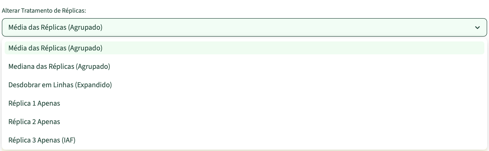

| Modo | Qué hace | Cuándo usar |
|---|---|---|
| **Media de las Réplicas** | Media aritmética de las réplicas disponibles. | Predeterminado. Apropiado cuando las réplicas reflejan variabilidad biológica genuina de la hoja/dosel. |
| **Mediana de las Réplicas** | Mediana de las réplicas. Equivalente a la media cuando n=2 (caso de Chl a/b); robusta a outliers en el IAF (n=3). | Cuando una de las lecturas puede haber sido espuria (ej.: ceptómetro leyendo el cielo por error) y no quiere que arrastre el valor consolidado. |
| **Desplegar en Filas** | Crea una fila por réplica, con la columna `Replica` indicando 1, 2 o 3. Puede incluso **triplicar** el número de filas. | Cuando quiere tratar cada lectura como observación independiente (ej.: para visualizar la variabilidad intra-sitio en boxplots). |
| **Solo Réplica 1** | Usa solo `Chl a`, `Chl b`, `IAF`. | Comparaciones de protocolo entre datasets que solo guardaron la 1ª réplica. |
| **Solo Réplica 2** | Usa solo `Chl a.1`, `Chl b.1`, `IAF.1`. | Auditoría — comparar con el modo Réplica 1 para detectar lecturas discrepantes. |
| **Solo Réplica 3 (IAF)** | Solo `IAF.2`; Chl a/b quedan vacíos (solo existe 1 réplica adicional para IAF). | Auditoría específica de ceptómetro. |

#### Por qué "Mediana" puede dar el mismo resultado que "Media"

Cuando hay solo **2 réplicas** (Chl a, Chl b), la mediana de dos valores es matemáticamente igual a la media de ellos. Por eso la aplicación muestra una nota explicativa justo debajo del desplegable cuando se selecciona el modo Mediana:

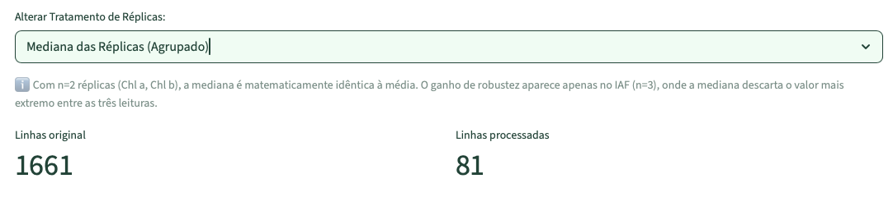

La ganancia real de robustez aparece **solo en el IAF** (3 réplicas) — la mediana descarta el valor más extremo entre las tres lecturas.

### 4.3 Avisos de descarte

El pipeline se ejecuta silenciosamente, pero muestra avisos amarillos destacados cuando **más del 50 %** de las filas se descartan en una sola etapa o en el balance final. Ese umbral fue calibrado para el escenario típico de planillas de fisiología: pequeñas pérdidas (1-5 %) son esperadas; pérdidas grandes generalmente significan que algo extraño está ocurriendo en el origen de los datos.

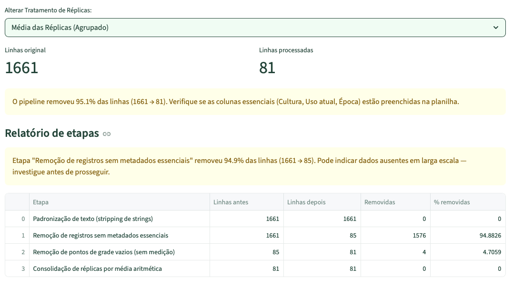

En el dataset de ejemplo `0_Dados_Fisiologia_RIO VERDE.xlsx`, la etapa 2 elimina el 94,9 % de las filas — porque la planilla tiene 1576 puntos de la grilla muestral registrados (con Latitud/Longitud y Fazenda) pero **sin** Cultura, Uso atual y Época rellenados. Esos puntos representan lugares previstos para la recolección pero que no tuvieron mediciones efectivas. **El comportamiento es correcto**; el aviso sirve para que confirme si realmente es el caso o si hay un problema de llenado que necesita corregirse en el origen.

#### Cuándo preocuparse por el aviso

| Escenario | Causa probable | Acción |
|---|---|---|
| Descarte > 90 % en la etapa 2 | La planilla contiene grilla muestral rellenada solo con coordenadas, sin metadatos de cultivo. | Verifique si esas filas eran esperadas. Si es así, ignore el aviso. |
| Descarte ~50 % en la etapa 2 | La mitad de la planilla tiene `Cultura` (o `Uso atual`, o `Época`) faltante. | Vuelva a Excel e investigue qué columna. Probablemente algo se perdió en la exportación. |
| Descarte > 10 % en la etapa 3 | Varios puntos de recolección sin ninguna medición fisiológica. | Puede ser real (recolección interrumpida) o una fuga de celdas vacías. |
| Avisos persisten después de ajustar | Modo de réplica incorrecto, o planilla con formato inesperado. | Intente alternar entre los 6 modos para ver cuál mantiene más filas. |

### 4.4 Leyendo el informe de etapas

Justo debajo de los avisos (si los hay), la página muestra la tabla **Informe de etapas** con cinco columnas: `Etapa`, `Filas antes`, `Filas después`, `Eliminadas`, `% eliminadas`.

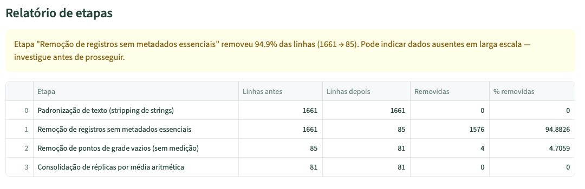

Para el dataset de ejemplo, la lectura típica es:

| Etapa | Antes | Después | Eliminadas |
|---|---|---|---|
| Estandarización de texto | 1661 | 1661 | 0 |
| Eliminación sin metadatos esenciales | 1661 | 85 | 1576 |
| Eliminación puntos de grilla vacíos | 85 | 81 | 4 |
| Consolidación de réplicas por media | 81 | 81 | 0 |

Resultado: **81 filas analíticas**, derivadas de las 1661 originales.

> **Consejo:** si selecciona el modo *Desplegar en Filas*, la última etapa tendrá `Filas después > Filas antes` (hasta 3×) — es el único caso en que el pipeline **aumenta** el número de filas. El aviso de "% eliminadas" muestra un valor negativo en ese caso, lo cual es esperado.

### 4.5 Interruptor "Usar datos procesados"

Cada una de las páginas analíticas (EDA, Regresión, Modelado, Espacial, Temporal, Comparativa) tiene un interruptor **Usar datos procesados** en la parte superior:

* **Activado** (predeterminado): la página usa el dataset **procesado** por el pipeline.
* **Desactivado**: la página usa el dataset **crudo** (salida directa de la Carga, sin ninguna etapa del pipeline).

Use la posición "desactivada" cuando quiera inspeccionar la planilla original — por ejemplo, para comprobar si una fila que desapareció del EDA realmente estaba ausente en el origen o fue eliminada en alguna de las etapas. Para el análisis principal, mantenga el interruptor **activado**.

### 4.6 Exportando el dataset procesado

Al pie de la página hay dos botones:

* **⬇ CSV** — archivo `dataset_fisiologia_limpo.csv` con codificación UTF-8 BOM (se abre directamente en Excel sin romper los acentos).
* **⬇ Excel** — archivo `dataset_fisiologia_limpo.xlsx` con la hoja única `Fisiologia_Limpo`.

Ambos contienen el dataset **después del pipeline**, en el modo de réplica actualmente seleccionado. Las tres columnas consolidadas (`Chl_a_media`, `Chl_b_media`, `IAF_media`) están presentes en cualquier modo; en el modo *Desplegar*, la columna `Replica` aparece adicionalmente.

> **Consejo de reproducibilidad:** después de cargar una planilla cruda y elegir un modo de réplica, exporte el CSV procesado y archívelo junto con sus resultados. Tendrá una instantánea de lo que de hecho fue analizado, independientemente de futuras evoluciones del pipeline.

---

## 5. Filtros globales

> Panel **⚙️ Panel de Configuraciones y Filtros** en la parte superior de las páginas EDA, Regresión, Modelado, Espacial y Serie Temporal.

Incluso después del pipeline, rara vez queremos analizar el dataset entero de una vez. El panel de filtros globales permite restringir reactivamente el análisis a un subconjunto — por cultivo, por finca, por época, por intervalo de fechas — sin necesidad de reprocesar el archivo. Los filtros se aplican en cada página de forma independiente y sus cambios se propagan a todos los gráficos y modelos de la página en tiempo real.

### 5.1 Estructura del panel

El panel es un *expander* — haga clic en el encabezado para expandir o contraer. Por defecto abre expandido en la primera visita a la página. Dentro de él, seis filtros organizados en dos filas de tres columnas:

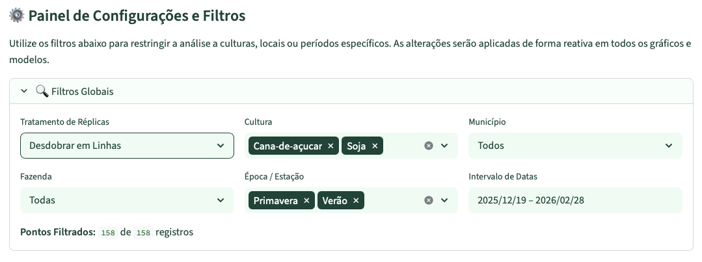

Fila 1: **Tratamiento de Réplicas** • **Cultura** • **Município**
Fila 2: **Fazenda** • **Época** • **Intervalo de Fechas**

Debajo de los filtros, una métrica de "Puntos Filtrados" muestra `n_filtrado / n_total` — útil para verificar rápidamente cuántas filas quedaron tras combinar todos los criterios.

### 5.2 Detalles de cada filtro

#### Tratamiento de Réplicas (atajo)

Replica el desplegable de la página Pipeline aquí en el panel. Cambiar el modo en la barra lateral **reprocesa todo el dataset** con el nuevo modo, manteniendo los demás filtros. Útil cuando está en una página de análisis y quiere comparar el efecto de cambiar de "Media" a "Mediana" sin volver a la página del Pipeline.

> **Atención:** al cambiar el modo aquí, la página se recarga (Streamlit `st.rerun()`). Sus selecciones en las demás pestañas se preservan.

#### Cultura

Multiselect con todos los cultivos presentes en el dataset. Por defecto, todos vienen marcados. Desmarque cultivos para excluirlos del análisis.

> En el dataset de ejemplo: opciones *Soja* y *Caña de azúcar*.

#### Município

Selectbox de selección única con la opción especial **"Todos"** en la parte superior. Útil cuando el dataset tiene más de una ciudad — restringe a un único municipio.

> En el dataset de ejemplo: solo *Rio Verde*. El filtro queda disponible pero no tiene efecto práctico.

#### Fazenda

Selectbox con **"Todas"** + una entrada por finca presente. **Importante:** si ya filtró por Município, solo aparecen las fincas de ese municipio (los filtros están encadenados).

> En el dataset de ejemplo: *Reunidas Baumgart* (soja) y *Usina Decal* (caña). Recuerde: estas dos fincas están **redundantes** con la columna `Cultura` — vea el panel de confundimiento en la pestaña **Calidad** del EDA. Filtrar por una es equivalente a filtrar por la otra.

#### Época

Multiselect con las épocas/estaciones disponibles. Comportamiento idéntico al filtro de Cultura.

> En el dataset de ejemplo: *Verano* (52 filas tras pipeline) y *Primavera* (29 filas).

#### Intervalo de Fechas

`date_input` con **dos punteros** — defina la fecha inicial y la fecha final. Por defecto usa el rango completo del dataset.

> En el dataset de ejemplo: tres fechas únicas (2025-12-19, 2026-01-16, 2026-02-28). El filtro es poco útil aquí dado el pequeño número de recolecciones, pero será potente en datasets con series mensuales.

### 5.3 Combinando filtros — comportamiento AND

Todos los filtros se aplican **simultáneamente** (operador lógico **Y**). Por ejemplo: seleccionar *Soja* en Cultura **y** *Verano* en Época mantiene solo las filas que satisfacen **ambos** criterios.

> **Consejo de diagnóstico:** si la métrica de "Puntos Filtrados" muestra 0, alguna combinación de sus filtros eliminó todas las filas. Contraiga el panel e intente reabrir una selección; el caso más común es cruzar Cultura y Fazenda contradictorias (ej.: Caña × Reunidas Baumgart en el dataset de ejemplo, que da 0).

### 5.4 Alcance de los filtros — por página, no global

A pesar del nombre "global", cada página tiene **su propio panel de filtros**. Cambiar a la pestaña EDA, ajustar filtros, y volver a Regresión **no** aplica los ajustes en Regresión — necesita configurarlos allí también. Esto es intencional: permite comparar análisis sobre subconjuntos diferentes lado a lado.

La excepción es el **Tratamiento de Réplicas** — cambiarlo interfiere en el dataset procesado y se refleja en todas las páginas, porque es una decisión del pipeline y no un filtro de visualización.

### 5.5 Cuándo NO usar filtros

* **Antes del EDA inicial.** Comience mirando el dataset entero para detectar patrones y *outliers*. Use los filtros después, para aislar grupos específicos.
* **Para limpiar datos malos.** Filtrar no es limpiar. Si una fila está incorrecta, corríjala en la planilla de origen y rehaga la carga; no la oculte con un filtro.
* **Para crear dos grupos a comparar.** Para eso, use la página **Comparativa** (capítulo 11), que tiene herramientas dedicadas (Mann-Whitney, log-lineal por grupo).

## 6. Análisis Exploratorio (EDA)

> Página **EDA** en el menú lateral.

El Análisis Exploratorio de Datos es el módulo más extenso de la aplicación. Doce pestañas, cada una con una familia de preguntas distinta: ¿cómo se distribuyen los valores? ¿Hay datos faltantes? ¿Las variables están correlacionadas? ¿Los grupos difieren entre sí? ¿Dónde están los puntos muestrales en el espacio? ¿Cuándo fueron recolectados? ¿Hay *outliers* a investigar?

Use el EDA **antes** de cualquier regresión o modelado — es donde descubre que `Fazenda` es redundante con `Cultura`, que `Ca` es prácticamente constante (y por lo tanto las correlaciones con ella son espurias), que la mitad de su dataset tiene `Peso Seco` faltante, o que una lectura fue grabada como 9999 por error.

Las 12 pestañas están organizadas en tres familias:

* **Descriptivo:** Resumen Estadístico, Calidad de los Datos, Relaciones Bivariadas, Boxplots, Dispersión, Correlación, Composición.
* **Geográfico y Temporal:** Espacial, Temporal.
* **Inferencia y Auditoría:** Inferencia (KW + Normalidad + VIF), Hotspots, Outliers.

### 6.1 Resumen Estadístico

Muestra las estadísticas descriptivas clásicas (count, mean, std, min, cuartiles, max) sumadas a **skewness** (asimetría) y **kurtosis** (curtosis) para cada variable numérica.

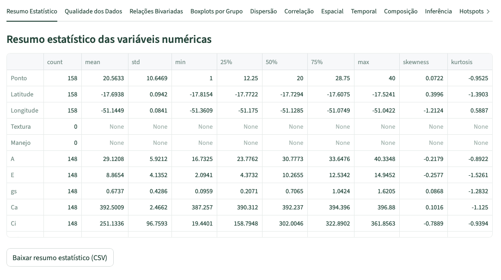

**Cómo leer:**

| Indicador | Interpretación |
|---|---|
| `count = 0` | Columna 100 % vacía (caso de `Manejo` y `Textura` en el dataset de ejemplo). |
| Diferencia grande entre `mean` y `50%` (mediana) | Distribución asimétrica. |
| `skewness` entre -0,5 y 0,5 | Distribución aproximadamente simétrica. |
| `|skewness|` > 1 | Distribución fuertemente asimétrica — considere transformación log o métodos no paramétricos. |
| `kurtosis` > 3 | Colas pesadas (más *outliers* que una normal). |
| `kurtosis` < 0 | Distribución aplanada (colas más ligeras que una normal). |

> **Consejo:** el botón **Descargar resumen estadístico (CSV)** exporta esa tabla. Es útil para incluir como anexo en un informe de campo.

### 6.2 Calidad de los Datos

Combina tres bloques: conteo de filas/columnas, *missing* por columna (tabla + gráfico) y — desde la v1.1 — auditoría de **confundimiento entre categóricas**.

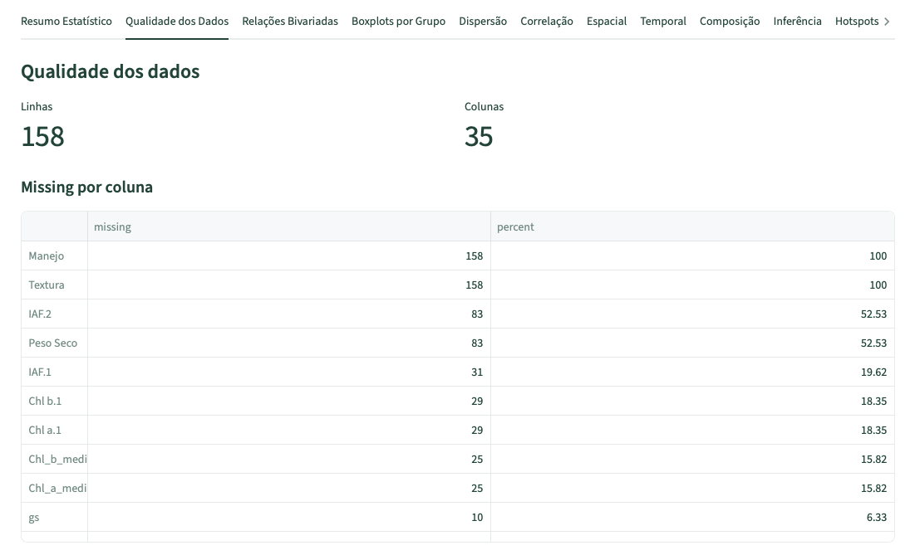

#### Missing por columna

Tabla ordenada de la más a la menos faltante, con `missing` (conteo absoluto) y `percent` (proporción). Justo debajo, un gráfico de barras con las columnas que tienen al menos 1 valor faltante.

> **En el dataset Rio Verde (modo *desplegar*):** `Manejo` y `Textura` aparecen con 100 % missing; `IAF.2` y `Peso Seco` con ~52 %; `IAF.1`, `Chl b.1`, `Chl a.1` con ~18 %; `gs` con ~6 %. Ese patrón (3ª réplica menos rellenada que la 2ª, que está menos que la 1ª) es típico de recolecciones de campo.

#### Frecuencia de categorías

Selectbox donde elige una columna categórica (`Cultura`, `Fazenda`, `Estágio`, etc.) y ve la tabla de conteo por nivel. Útil para detectar problemas de escritura ("Verão" vs "verao", "soja" vs "Soja").

#### Confundimiento entre categorías

Esta es una sección **fundamental** que evita conclusiones engañosas en el resto del manual. Muestra una tabla con los pares de columnas categóricas que particionan las filas de la **misma forma**, calculada por *V de Cramér* (ver Glosario §13).

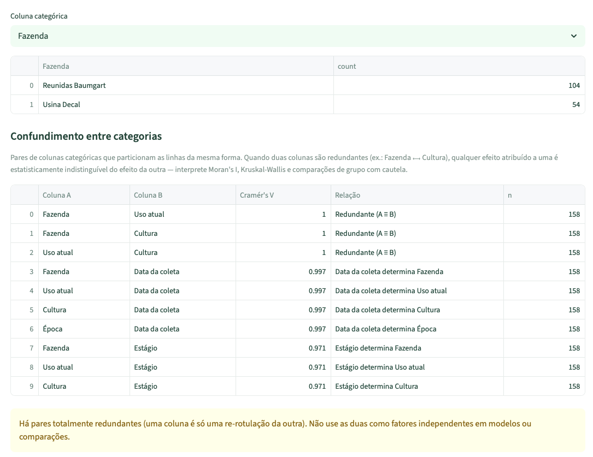

**Tipos de relación que aparecen:**

| Relación | Qué significa | Ejemplo en el dataset Rio Verde |
|---|---|---|
| **Redundante (A ≡ B)** | Las dos columnas son equivalentes; una es solo un reetiquetado de la otra. **V de Cramér = 1,000 en ambos sentidos.** | `Fazenda ⟷ Cultura ⟷ Uso atual` — todas particionan las 81 filas en "Reunidas Baumgart / Soja / Ciclo Curto" vs "Usina Decal / Cana / Perene". |
| **{A} determina {B}** | Cada nivel de A pertenece a un único nivel de B, pero lo inverso no es cierto (B tiene más niveles). | `Estágio` determina `Cultura` (cada estadio fenológico solo ocurre en un cultivo). |
| **Asociación alta (parcial)** | Asociación fuerte, pero ninguna de las direcciones es determinística. | Raro en este dataset. |

**Por qué esto importa:**

Cuando dos columnas son redundantes, cualquier "efecto" atribuido a una es estadísticamente **indistinguible** del efecto de la otra. Si ejecuta un Moran's I y descubre un cluster espacial enorme (HH en una finca, LL en la otra), lo que está siendo captado puede ser **diferencia biológica entre los cultivos**, y no **autocorrelación espacial real**. De la misma forma, comparar `gs` entre fincas es equivalente a comparar `gs` entre cultivos — solo con una etiqueta diferente.

> **Cuando hay pares redundantes**, la app muestra un aviso amarillo destacado: *"Hay pares totalmente redundantes — no use ambos como factores independientes en modelos o comparaciones."*

### 6.3 Relaciones Bivariadas (distribuciones univariadas)

A pesar del nombre, esta pestaña muestra **distribuciones univariadas** — un histograma por variable seleccionada. El nombre refleja una elección histórica de la app; el contenido es estrictamente *univariado*.

**Configuraciones:**

* **Variables** (multiselect) — hasta 3 variables numéricas, con valores predeterminados sensatos.
* **Bins** (slider) — número de clases del histograma (10 a 100).
* **KDE** (checkbox) — superpone una estimación de densidad kernel.

**Cómo usar:** comience con los valores predeterminados y ajuste `bins` si la distribución parece "rugosa" (pocos bins) o "ruidosa" (muchos bins). El KDE ayuda a identificar bimodalidad — útil para señalar cuando una variable es mezcla de dos poblaciones (ej.: soja + caña). Cuando el KDE muestra dos picos, considere ejecutar análisis **por grupo** (con `hue` en la pestaña Boxplot o en la Comparativa).

### 6.4 Boxplots por Grupo

Box-plots (o *violin plots*) de una variable numérica agrupada por una columna categórica, opcionalmente con una segunda categórica como `hue`.

**Configuraciones principales:**

* **Variable objetivo** — la numérica que va en el eje Y.
* **Agrupamiento (X)** — la categórica que va en el eje X.
* **Color (hue)** — opcional, segunda categórica que colorea los boxes lado a lado.
* **Tipo** — Boxplot o Violinplot.

**Cómo leer:**

| Elemento | Significado |
|---|---|
| Caja | percentil 25 al 75 (rango intercuartil, IQR). |
| Línea horizontal en la caja | Mediana. |
| "Bigotes" (whiskers) | Se extienden hasta 1,5 × IQR. |
| Puntos aislados | Outliers (por encima de 1,5 × IQR). |

El violinplot agrega la forma de la distribución (ancho proporcional a la densidad local). Use **violín** cuando la forma importa (bimodalidad); use **boxplot** cuando quiere comparar muchos grupos rápidamente.

> **Cuidado con `hue` redundante:** si selecciona `Cultura` en el eje X **y** `Fazenda` como `hue` en el dataset Rio Verde, verá dos boxes idénticos lado a lado por categoría — porque son la misma partición (ver §6.2). Elija un `hue` que **diferencie** dentro del grupo (ej.: `Estágio` dentro de Cultura).

### 6.5 Dispersión (pairplot)

Scatter de **pares** de variables numéricas en una grilla triangular inferior. Opcionalmente coloreando los puntos por una categórica.

**Configuraciones:**

* **Variables** (multiselect) — entre 2 y 6 variables. Más de 6 queda ilegible.
* **Color (hue)** — opcional. Útil para visualizar la separación entre cultivos.
* **Muestra** (slider 100-5000) — limita el número de puntos graficados. Para el dataset Rio Verde de 81 filas, irrelevante; importante en datasets grandes para mantener el render rápido.

**Qué buscar:**

* **Pares con correlación visible** (línea clara ascendente o descendente) — confírmelo después en la pestaña Correlación (§6.6).
* **Outliers extremos** — puntos que quedan visiblemente lejos de la nube. Márquelos mentalmente para investigar en la pestaña Outliers (§6.12).
* **No-linealidades** — curvas o patrones en U sugieren que la regresión lineal es inadecuada y que Spearman es mejor que Pearson.

### 6.6 Correlación

Heatmap de correlación entre las variables numéricas seleccionadas, en tres métricas alternativas:

| Método | Mide | Cuándo usar |
|---|---|---|
| **Pearson** | Asociación lineal. | Variables aproximadamente normales y relación lineal. |
| **Spearman** | Asociación monotónica (orden). | **Predeterminado recomendado** — robusto a outliers y a no-linealidades monotónicas. |
| **Kendall** | Concordancia de pares. | Datasets pequeños (n < 30) con muchos empates. |

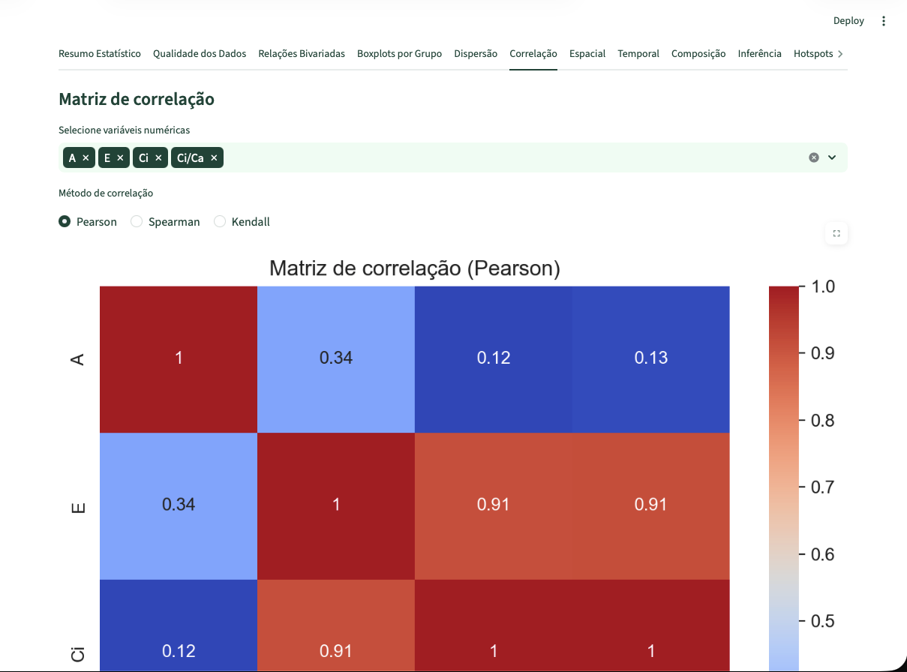

**Cómo leer valores típicos:**

| Rango de r | Interpretación |
|---|---|
| `|r|` ≥ 0,8 | Correlación muy fuerte — confirme si no es por construcción matemática (Ci/Ca derivado de Ci/Ca). |
| 0,5 ≤ `|r|` < 0,8 | Fuerte. |
| 0,3 ≤ `|r|` < 0,5 | Moderada. |
| `|r|` < 0,3 | Débil a despreciable. |

> **En el dataset Rio Verde:** aparecerá `E ↔ gs` ≈ 0,93 (clásico fisiológico), `YII ↔ ETR` ≈ 0,96 (derivada — ETR es función de YII), `Ci ↔ Ci/Ca` = 1,00 (Ca casi constante, entonces Ci/Ca ≈ Ci × cte). Esos tres pares son **esperados** y no indican problema de los datos; reflejan la química/matemática de las propias variables.

Use el botón **Descargar correlación (CSV)** para incluir la matriz en un informe.

### 6.7 Espacial (exploratorio)

Mapa de dispersión de los puntos de recolección graficados en Longitud × Latitud, coloreados y dimensionados por una variable elegida. Opcionalmente faceteado por una categórica (ej.: un panel por Cultivo).

**Diferencia respecto a la página Análisis Espacial:** aquí es solo **visualización exploratoria** — no hay interpolación, autocorrelación o kriging. Use esta pestaña para tener una visión rápida de la distribución geográfica antes de pasar a análisis estadístico-espaciales (cap. 9).

### 6.8 Temporal (exploratorio)

Serie temporal agregada (media o mediana diaria) de una variable, opcionalmente coloreada por una categórica.

> Para el dataset Rio Verde, con solo tres fechas distintas, la serie queda como tres puntos. En datasets con series largas (campañas mensuales o semanales), esta pestaña se convierte en el gráfico de visión general antes de la descomposición STL (cap. 10).

### 6.9 Composición

Gráfico doble (barras + circular) que muestra la composición de una columna categórica. Útil para presentaciones — comunica visualmente "60 % del dataset es soja, 40 % es caña".

### 6.10 Inferencia

Esta pestaña combina **tres análisis estadísticos** distintos en una única pantalla: Kruskal-Wallis (comparación entre grupos), pruebas de normalidad (Shapiro-Wilk, Anderson-Darling, D'Agostino-Pearson) y VIF (multicolinealidad). Es la pestaña más densa del EDA.

#### Kruskal-Wallis (KW)

Prueba no paramétrica para comparar **distribuciones** de una variable numérica entre **dos o más grupos** definidos por una columna categórica. Hipótesis nula: todos los grupos provienen de la misma distribución.

**Configuraciones:**

* **Columna de agrupamiento** — categórica (`Cultura`, `Época`, `Estágio`, etc.).
* **Variables numéricas** — una o más (multiselect).
* **Alpha (α)** — nivel de significancia (predeterminado 0,05).
* **N mínimo por grupo** — excluye automáticamente niveles con menos de N muestras (predeterminado 5). Vea por qué en el siguiente cuadro.

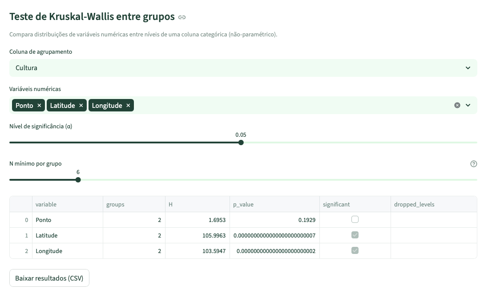

**Por qué existe el "N mínimo por grupo":** con grupos de tamaño 2 o 3, el KW tiene **bajo poder estadístico** y el valor-p se vuelve impreciso. El slider permite descartar esos grupos antes de la prueba. La columna `dropped_levels` en la tabla de resultados muestra cuáles fueron excluidos — útil para auditoría. Si hay descarte, la app emite un aviso explicativo debajo de la tabla.

**Cómo leer la tabla de resultados:**

| Columna | Significado |
|---|---|
| `variable` | La variable probada. |
| `groups` | Número de grupos que sobrevivieron al filtro de N mínimo. |
| `H` | Estadística de Kruskal-Wallis (no paramétrica). |
| `p_value` | Probabilidad bajo H₀. |
| `significant` | `True` si p < α. |
| `dropped_levels` | Niveles excluidos por tener n < mínimo. |

> **Cuando k = 2 grupos**, el Kruskal-Wallis es matemáticamente equivalente al **Mann-Whitney U** *two-sided*. La app mantiene la etiqueta "Kruskal-Wallis" por consistencia, pero puede reportarlo como Mann-Whitney cuando describa la prueba en su artículo.

#### Pruebas de normalidad

Tres pruebas complementarias aplicadas a cada variable seleccionada:

| Prueba | Característica |
|---|---|
| **Shapiro-Wilk** | La más sensible para n < 5000. Estándar de la literatura. |
| **Anderson-Darling** | Buena potencia en las colas. Devuelve estadística A² + valor crítico al 5 %. |
| **D'Agostino-Pearson (K²)** | Combina pruebas de asimetría y curtosis. Robusto a empates. |

La columna `normal_at_alpha` es `True` solo cuando **las tres** pruebas concuerdan en que no hay rechazo de la normalidad.

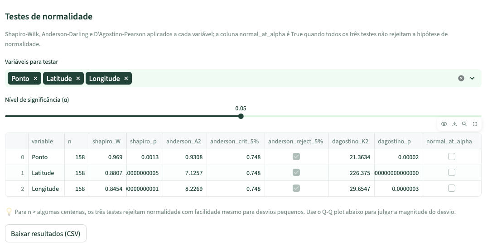

**Atención al tamaño de la muestra:** con n grande (por encima de algunas centenas), las tres pruebas detectan desviaciones mínimas de la normal y rechazan casi siempre. Esto **no** significa que la distribución sea inutilizable para análisis paramétricos — significa apenas que no es *perfectamente* normal. La app incluye una nota explicativa justo debajo de la tabla.

Para juzgar la **magnitud** de la desviación (y no solo su significancia), mire el **Q-Q plot** que aparece justo debajo:

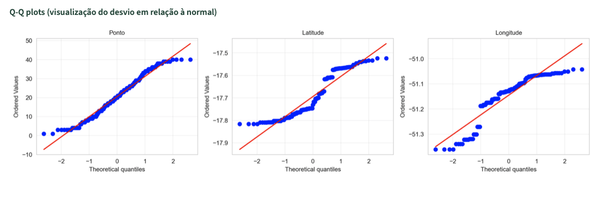

**Cómo leer un Q-Q plot:**

* Puntos sobre la línea roja (o próximos a ella) → distribución próxima a la normal.
* Puntos formando una curva en "S" → colas más ligeras o pesadas que la normal.
* Puntos lejos de la línea en los extremos → outliers o desviaciones en las colas (típico en variables fisiológicas).

#### VIF — Variance Inflation Factor

Mide la multicolinealidad entre variables explicativas. Para cada variable, el VIF se calcula regresándola contra todas las demás y devolviendo `1 / (1 - R²)`.

| Rango de VIF | Interpretación |
|---|---|
| VIF < 5 | Multicolinealidad baja — variables suficientemente independientes. |
| 5 ≤ VIF < 10 | Multicolinealidad moderada. |
| VIF ≥ 10 | Multicolinealidad severa — considere eliminar una de las variables. |

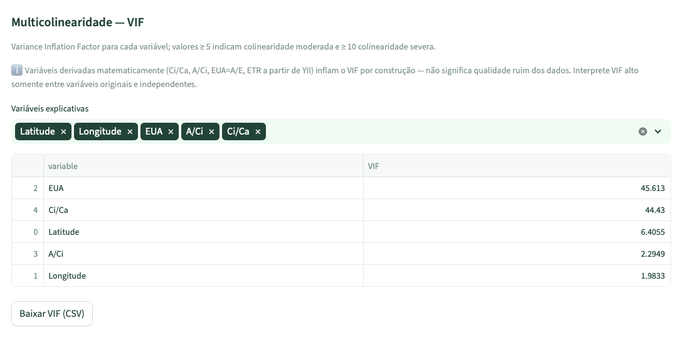

> **Atención a variables derivadas:** la app muestra una nota alertando que `Ci/Ca`, `A/Ci`, `EUA = A/E` y `ETR` son razones/funciones de otras variables en el esquema, lo que infla el VIF **por construcción matemática**, sin que esto refleje un problema de calidad de los datos. En el dataset Rio Verde, por ejemplo, `Ci/Ca` llega a VIF ≈ 149.000 — no es un número que sugiera eliminar Ci/Ca, es una señal de que Ca es prácticamente constante y Ci/Ca se volvió un reescalado de Ci.

### 6.11 Hotspots

Ranking de los `top_n` grupos con mayor valor medio (o mediano) de una variable objetivo, con gráfico de barras horizontales. Opcionalmente faceteado por una segunda categórica.

**Cuándo usar:** identificar rápidamente qué fincas, estadios o regiones concentran los mayores valores de una variable fisiológica. Salida exportable como CSV para inclusión en informes de campo.

### 6.12 Outliers (multi-método)

Detección de outliers combinando **cinco** métodos con criterios bien diferentes:

| Método | Premisa | ¿Robusto a outliers? |
|---|---|---|
| **Z-score** (\|z\| > 3) | Distribución aproximadamente normal. | No — la desviación estándar es arrastrada por los propios outliers. |
| **IQR (1,5×)** | Ninguna (no paramétrico). | Sí. |
| **Isolation Forest** | No paramétrico, basado en árboles. | Sí. |
| **LOF** (Local Outlier Factor) | No paramétrico, basado en densidad local. | Sí. |
| **Elliptic Envelope** | **Normalidad multivariada.** | **No — sensible a datos bimodales o asimétricos.** |

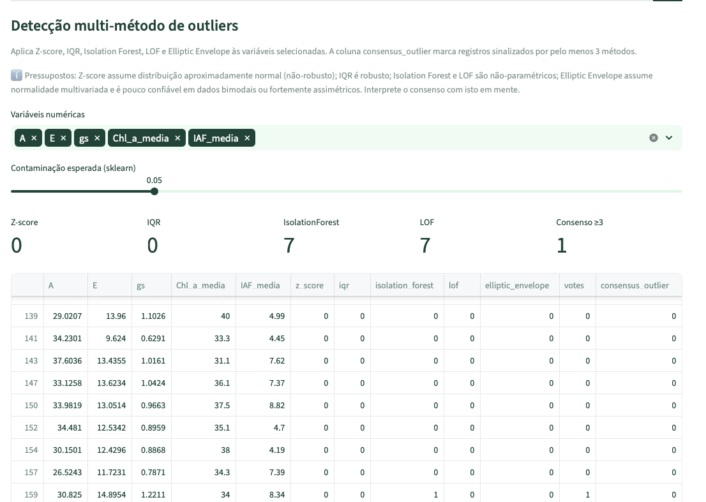

**Consenso ≥3 votos:** la app marca una fila como outlier por consenso cuando al menos **3 de los 5 métodos** concuerdan. Es una regla deliberadamente conservadora: cada método por sí solo genera falsos positivos con perfil diferente; exigir mayoría reduce drásticamente las marcaciones falsas.

> **Limitación en el dataset Rio Verde:** como tiene solo 81 filas y dos cultivos con distribuciones muy distintas, los métodos basados en normalidad (Z-score, Elliptic Envelope) tienden a subdetectar, mientras que los basados en densidad (LOF) pueden marcar **cultivos enteros** como "outliers". Use la tabla de auditoría para investigar caso por caso antes de eliminar.

La tabla de salida lista las primeras 200 filas con cada flag binaria (z_score, iqr, isolation_forest, lof, elliptic_envelope), el conteo de votos, y el consenso final. Disponible para descarga como CSV.

## 7. Regresión bivariada

> Página **Regresión** en el menú lateral.

Esta página está dedicada a la **regresión lineal simple** entre **dos variables numéricas**, con opciones de coloración por categoría (`hue`) y faceteado. Es útil para inspeccionar relaciones fisiológicas clásicas (gs vs. A, Ci vs. A) y validar visualmente si la relación es aproximadamente lineal antes de pasar a un modelado más sofisticado (cap. 8).

### 7.1 Presets fisiológicos

En la parte superior de la página, un selector **Preset** ofrece cuatro combinaciones preconfiguradas basadas en pares fisiológicamente significativos:

| Preset | X | Y | Color | Interpretación |
|---|---|---|---|---|
| Conductancia Estomática (gs) vs. Fotosíntesis (A) | gs | A | Cultura | Relación clásica: mayor gs → más CO₂ entra → mayor A, hasta un punto de saturación. |
| CO₂ Interno (Ci) vs. Fotosíntesis (A) | Ci | A | Cultura | Curva A-Ci — fundamental en el modelo Farquhar de fotosíntesis. |
| Conductancia Estomática (gs) vs. Transpiración (E) | gs | E | Cultura | Casi siempre fuertemente lineal: gs gobierna la transpiración. |
| Clorofila a vs. Fotosíntesis (A) | Chl_a_media | A | Cultura | Asociación positiva esperada — más clorofila, más captura de luz. |

> Los presets solo aparecen cuando **ambas** columnas están presentes en el dataset. Si seleccionó un modo de réplica que no crea las columnas (`Chl_a_media` etc.), el preset respectivo desaparece.

### 7.2 Regresión personalizada

Debajo de los presets, una sección **Regresión personalizada** da control total:

* **Variable X** (selectbox numérico).
* **Variable Y** (selectbox numérico, excluyendo la X).
* **Color (hue)** — opcional, categórica.
* **Facetar (col)** — opcional, categórica que abre un panel por nivel.
* **Intervalo de confianza** (slider 0-99 %) — banda sombreada alrededor de la recta.
* **Muestra máxima** (slider 100-5000) — limita los puntos graficados para el rendimiento.

La salida es un `lmplot` de seaborn: scatter + recta de regresión + banda de IC. Cuando `hue` está activado, cada categoría recibe su propia recta (regresión **por grupo**).

### 7.3 Cómo leer el resultado

Debajo del gráfico, una nota muestra la **correlación de Pearson** entre X e Y y el `n` del gráfico. Úsela para una verificación rápida — si la r está próxima a cero pero el gráfico parece lineal, probablemente hay alguna transformación log/sqrt subyacente que haría aparecer la relación.

> **Limitaciones de esta página:**
>
> * Es **solo lineal** — no hay ajuste polinomial, log-lineal, o modelos mixtos. Para esos casos, use la página Comparativa (regresión log-lineal por grupo, cap. 11) o exporte el dataset procesado y use R/Python externamente.
> * No imprime coeficientes (intercepto, pendiente, valor-p) — solo el gráfico y la correlación. Para regresión **con diagnósticos completos**, use la página Modelado (cap. 8) seleccionando el modelo `Regresión Lineal`.

---

## 8. Modelado predictivo

> Página **Modelado** en el menú lateral.

Esta página permite **entrenar y comparar múltiples modelos** simultáneamente, con validación cruzada y métricas de holdout. Un selector en la parte superior (**Tipo de tarea**) alterna entre **Regresión** (objetivo numérico — ej.: predecir la fotosíntesis `A`) y **Clasificación** (objetivo categórico — ej.: predecir la especie/cultivo). Las subsecciones 8.1–8.7 describen el flujo de regresión; la §8.8 cubre la clasificación.

### 8.1 Eligiendo target y features

* **Variable objetivo (target)** — una variable numérica. Predeterminado: `A`.
* **Features** — múltiples variables explicativas, numéricas y categóricas. Predeterminado (en el dataset Rio Verde): `gs`, `Ca`, `Ci`, `Ci/Ca`, `E`, `YII`, `ETR`, `Chl_a_media`, `Chl_b_media`, `IAF_media`, `Cultura`, `Fazenda`, `Época`.

Las categóricas se codifican automáticamente vía `OneHotEncoder`. Las numéricas que necesitan escala (LR y KNN) reciben `StandardScaler` en el pipeline.

### 8.2 Modelos disponibles

Cinco modelos de `scikit-learn`, todos con hiperparámetros razonables preconfigurados:

| Modelo | Características | Cuándo preferir |
|---|---|---|
| **Regresión Lineal** | Coeficientes interpretables; presupone linealidad. | Cuando se busca *explicación* más que *predicción* pura. |
| **Random Forest** | 200 árboles; buen desempeño out-of-the-box; captura no-linealidades e interacciones. | Predeterminado recomendado para modelado predictivo. |
| **Árbol de Decisión** | Modelo simple, fácil de visualizar. | Solo como baseline o para entender reglas. |
| **Gradient Boosting** | Frecuentemente más preciso que Random Forest; más sensible al overfit. | Cuando quiere máxima exactitud y tiene tiempo de tunear. |
| **KNN** | Sin entrenamiento; la predicción depende de los k=5 vecinos. | Datasets pequeños y suaves. |

### 8.3 Holdout y validación cruzada

Dos sliders controlan el esquema de validación:

* **Tamaño del holdout** (0,10 a 0,40) — fracción de los datos reservada para prueba. Predeterminado 0,30.
* **Pliegues de la validación cruzada** (3 a 10) — número de folds. Predeterminado 5.

### 8.4 Estrategia de validación cruzada

Aquí está la decisión más importante de esta página. Un radio ofrece dos opciones:

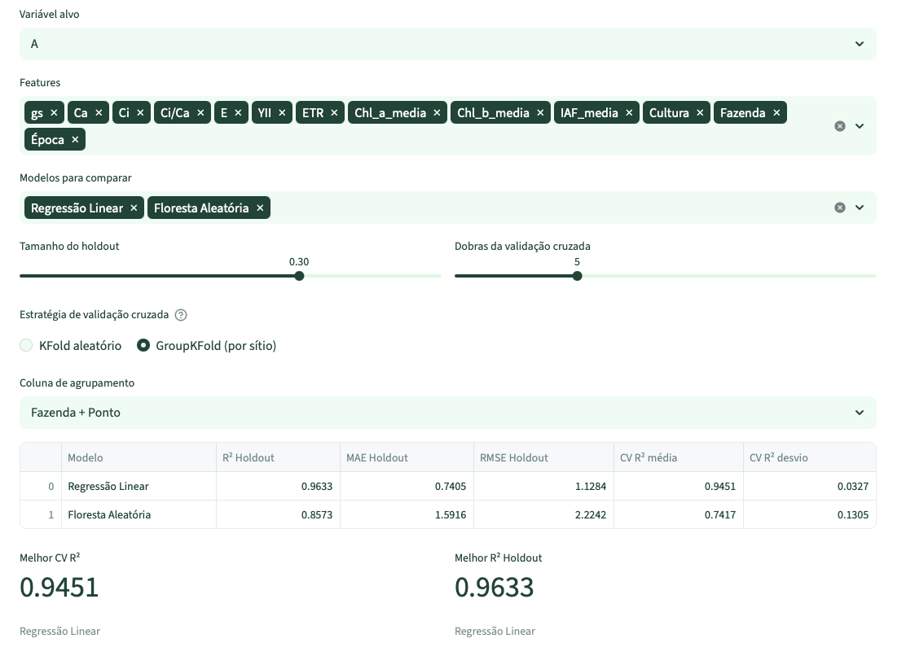

| Estrategia | Descripción | Cuándo usar |
|---|---|---|
| **KFold aleatorio** | Filas distribuidas aleatoriamente entre folds. | Cuando **no hay pseudoreplicación** — cada fila del dataset es una observación genuinamente independiente. |
| **GroupKFold (por sitio)** | Todas las réplicas de un mismo sitio quedan **en el mismo fold**. El modelo nunca ve en entrenamiento filas correlacionadas con las de la prueba. | **Recomendado** siempre que hay más de una medición por punto muestral (modos de réplica *desplegar*; sitios con múltiples fechas; etc.). |

#### Columna de agrupamiento

Cuando elige GroupKFold, aparece un selectbox **Columna de agrupamiento** con candidatos:

* **Fazenda + Punto** — opción sintética que combina las dos columnas, creando un identificador único de sitio. Predeterminado recomendado.
* **Fazenda** — agrupa por finca; puede dar pocos grupos si el dataset tiene solo 2-3 fincas.
* **ID**, **LABEL** — identificadores únicos por fila; casi equivalente a KFold aleatorio.
* Otras categóricas presentes en el dataset.

> **Ajuste automático de folds:** si el número de grupos es menor que el número de folds elegido, la app reduce automáticamente los folds y muestra un aviso amarillo (ej.: "Solo 4 grupos disponibles; reduciendo los pliegues de 5 a 4").

#### Por qué esto importa para el dataset Rio Verde

Confirmamos durante la auditoría que la fuga (leak) en ese dataset específico es pequeña (R² ~0,946 con random vs. ~0,944 con GroupKFold para Regresión Lineal). **Pero:** ese escenario es privilegiado por la señal mecanística muy fuerte entre `A` y los predictores. En datasets futuros con más réplicas por sitio (ej.: 3 réplicas × varias fechas × 2 cultivos), la diferencia puede ser mucho mayor — y el KFold aleatorio va a **sobrestimar** el R² esperado en campo. GroupKFold da una estimación más conservadora y realista.

### 8.5 Leyendo la tabla de resultados

La tabla compara los modelos seleccionados en cinco métricas:

| Métrica | Significado |
|---|---|
| `R² Holdout` | Coeficiente de determinación en el holdout (30 % de los datos). |
| `MAE Holdout` | Error absoluto medio (misma unidad del target). |
| `RMSE Holdout` | Raíz del error cuadrático medio. |
| `CV R² media` | Media del R² en los K pliegues de la CV. |
| `CV R² desvío` | Desviación estándar del R² en los pliegues (estabilidad del modelo). |

El **mejor modelo** se destaca en dos métricas grandes encima de la tabla ("Mejor CV R²" y "Mejor R² Holdout"). La línea de baseline suele ser la Regresión Lineal; los modelos más sofisticados (RF, GB) necesitan superarla con holgura para justificar su uso.

### 8.6 Predichos vs. observados

Para cualquier modelo entrenado, puede graficar un gráfico de **predicho × observado**. Los puntos a lo largo de la diagonal roja indican predicción perfecta. Las desviaciones sistemáticas (todos los puntos por debajo o por encima de la línea) indican sesgo que merece investigación.

### 8.7 Importancia de features

Para modelos basados en árboles (RF, GB, DT), aparece un gráfico de barras con las **importancias de features** (feature_importances_ de sklearn). Para Regresión Lineal, muestra los **|coeficientes|** absolutos tras la estandarización. KNN no proporciona importancia.

> **Cuidado de interpretación:** las importancias de árboles **dividen el crédito** entre variables correlacionadas. Si `Ci` y `Ci/Ca` cargan casi la misma información (VIF > 10⁴ en Rio Verde, ver §6.10), el modelo divide la importancia entre las dos, y ninguna aparece como "muy importante" por sí sola. Mire el conjunto, no cada barra aisladamente.

### 8.8 Modo Clasificación

Seleccionando **Clasificación** en el *Tipo de tarea*, el objetivo pasa a ser una columna **categórica** (ej.: cultivo, especie, clase de manejo). Se entrenan y comparan hasta **8 clasificadores** de `scikit-learn`: Regresión Logística, Random Forest, Árbol de Decisión, Gradient Boosting, HistGradientBoosting, KNN, SVM y Naive Bayes.

La evaluación usa validación cruzada (con opción de **GroupKFold** por sitio, como en la regresión) y holdout, reportando:

* **Exactitud, F1, Precisión y Recall** (macro) por modelo, en la tabla comparativa;
* **Matriz de confusión** del mejor modelo;
* **Importancia de variables** (o |coeficientes| en la Logística).

Hay además un selector de **escalado** (StandardScaler / ninguno) para los modelos sensibles a la escala (Logística, KNN, SVM). El flujo es simétrico al de regresión — la diferencia es el objetivo categórico y las métricas de clasificación.

---

## 9. Análisis espacial

> Página **Análisis Espacial** en el menú lateral.

Esta página reúne **seis pestañas** de análisis geoespacial: interpolación determinística (IDW), autocorrelación global y local (Moran's I), hotspots (Getis-Ord Gi*), agregación en grilla UTM regular, kriging ordinario con semivariograma esférico, y mapa sobre los límites administrativos de Rio Verde, GO.

Desde la v1.1, **todos los análisis de distancia** (IDW, kriging, Moran KNN, Gi*) operan internamente en **metros UTM** (EPSG 32722 para Rio Verde), incluso cuando el eje de los mapas aparece en latitud/longitud. Esto elimina la anisotropía introducida cuando se computa la distancia euclidiana en grados (1° de longitud ≈ 105 km vs. 1° de latitud ≈ 111 km en -17,8°).

### 9.1 IDW — Interpolación por Distancia Inversa

> Pestaña **IDW**.

Estima el valor de una variable en una grilla regular usando la media ponderada de los puntos muestrales conocidos, con **peso inversamente proporcional a la distancia**.

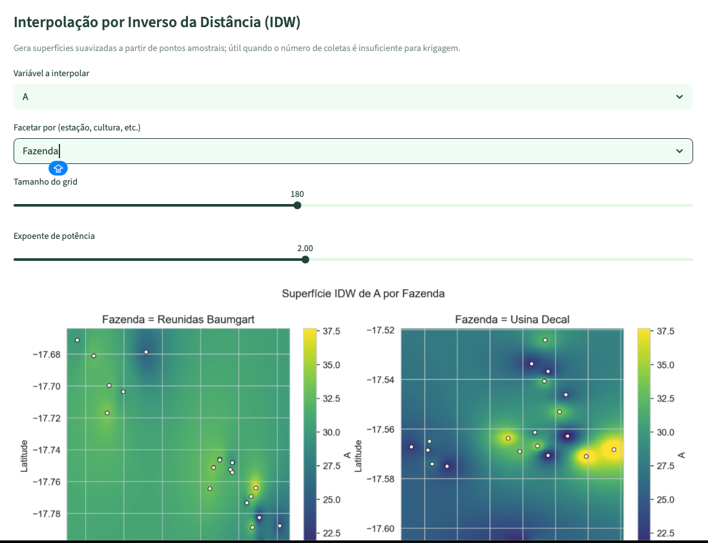

**Configuraciones:**

* **Variable objetivo** — qué variable interpolar.
* **Facetar por** — categórica opcional; genera un mapa por nivel (útil para comparar Soja vs. Caña lado a lado).
* **Tamaño del grid** (80-320) — resolución de la interpolación. Mayor = más bonito, pero más lento. Predeterminado 180.
* **Power** (0,5-4,0) — exponente del inverso de la distancia. Predeterminado 2.
  * `power=1`: suavizado fuerte, los valores tienden a la media.
  * `power=2`: predeterminado, equilibrio.
  * `power=4`: cada punto domina su entorno inmediato.

**Cómo leer el mapa:** los colores siguen la paleta `viridis`. Los círculos blancos son los **puntos muestrales reales**; el resto de la superficie es interpolada. Las áreas lejos de cualquier punto muestreado tienen un valor poco confiable — el IDW fuerza la continuidad incluso donde no hay dato.

> **Limitación:** el IDW es **determinístico** — no hay banda de incertidumbre. Para incertidumbre estadística, use Kriging (§9.5).

### 9.2 Moran's I — Autocorrelación espacial

> Pestaña **Moran**.

Mide si los valores **semejantes** tienden a quedar próximos en el espacio. Devuelve un índice global y mapas de clusters locales (LISA).

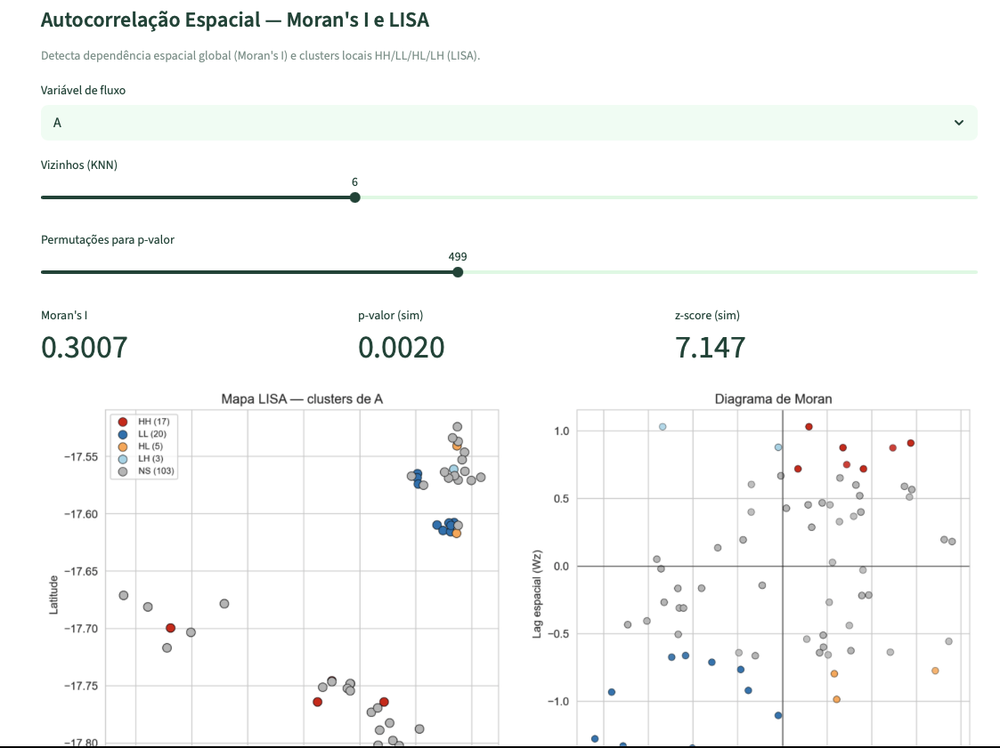

**Configuraciones:**

* **Variable objetivo**.
* **k vecinos más próximos** (3-12) — cuántos vecinos definen el "entorno" de cada punto.
* **Número de permutaciones** (99-999) — cuanto mayor, más preciso el valor-p (Monte Carlo).

**Métricas globales:**

| Métrica | Interpretación |
|---|---|
| `I` próximo a +1 | Autocorrelación positiva fuerte (valores parecidos se agrupan). |
| `I` próximo a 0 | Distribución aleatoria en el espacio. |
| `I` próximo a -1 | Autocorrelación negativa (valores parecidos quedan alejados; raro). |
| `p_sim` < 0,05 | I es estadísticamente significativo. |

**Mapa LISA — cuatro categorías:**

| Cluster | Color | Significado |
|---|---|---|
| **HH** | Rojo | Sitio con valor alto rodeado de vecinos altos (hotspot). |
| **LL** | Azul | Sitio con valor bajo rodeado de vecinos bajos (coldspot). |
| **HL** | Naranja | Sitio alto rodeado de bajos (outlier alto). |
| **LH** | Azul claro | Sitio bajo rodeado de altos (outlier bajo). |
| **NS** | Gris | No significativo. |

> **Cuidado con el confundimiento:** si la pestaña Calidad (§6.2) reporta `Fazenda ⟷ Cultura` como redundantes, y cada cultivo está concentrado en una finca, el **Moran's I va a ser altísimo** (~0,9). Pero ese cluster espacial puede ser apenas el reflejo del efecto-Cultivo disfrazado de efecto-espacio. Confírmelo ejecutando el Moran condicionalmente: filtre por un único cultivo, restrinja el dataset, y vea si el I permanece alto.

### 9.3 Getis-Ord Gi* — Hotspots formales

> Pestaña **Gi***.

Detecta **hotspots** (cluster de valores altos) y **coldspots** (cluster de valores bajos) usando una banda de distancia en vez de KNN. Más formal y directo que LISA cuando el objetivo es **solo identificar dónde están las concentraciones**.

**Cálculo de la banda d*:** la app toma cada punto, encuentra la distancia a su k-ésimo vecino, y usa el **máximo** de esas distancias × 1,001. Esto garantiza que todo punto tenga al menos k vecinos en el cálculo del Gi*. El valor de d* aparece en metros, con una nota indicando el EPSG UTM utilizado.

Salida: mapa con puntos coloreados como **Hotspot** (rojo), **Coldspot** (azul) o **NS** (gris); tabla-resumen con media y mediana por clase; CSV exportable.

### 9.4 Grilla UTM regular

> Pestaña **Grilla UTM**.

En vez de interpolar una superficie continua, agrega los puntos muestrales en **celdas cuadradas regulares** (en km) y calcula la media/mediana de una variable por celda. Útil para presentar valores medios "por cuadrante" en la comunicación a gestores.

**Configuraciones:**

* **Variable objetivo**.
* **Tamaño de la celda** (0,5-10 km) — lado del cuadrado.
* **Facetar por** — opcional.
* **Agregación** — media o mediana.

Salida: mapa coroplético (polígonos coloreados) + tabla de las top-50 celdas ordenadas por valor + CSV.

### 9.5 Kriging ordinario

> Pestaña **Kriging**.

Interpolación **estadística** basada en la estructura espacial de los datos. A diferencia del IDW, devuelve estimaciones con base en un **variograma** ajustado — captura cuán similar es la relación entre pares de puntos en función de la distancia.

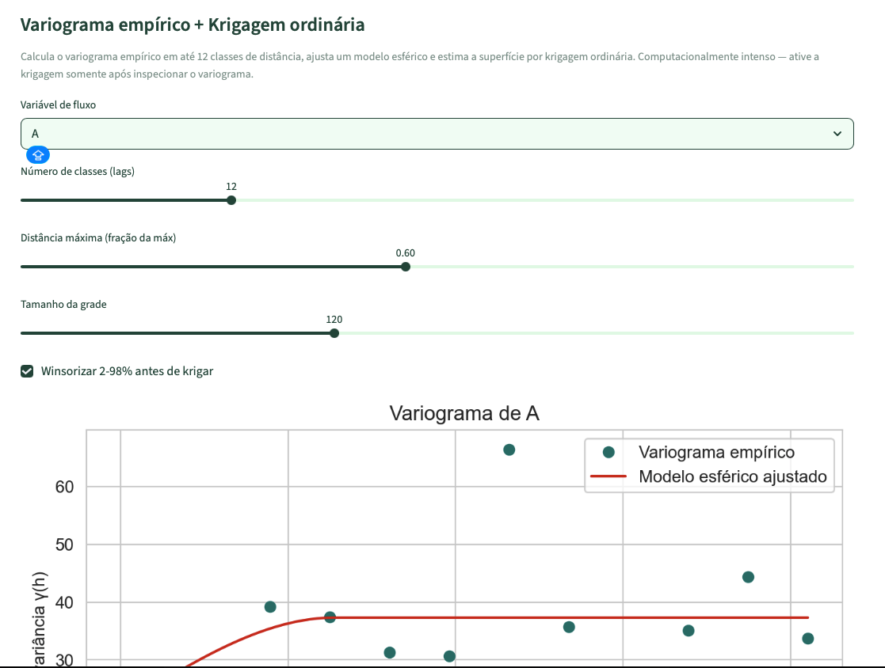

**Flujo de dos etapas:**

#### Etapa 1: ajustar el variograma

* **Variable objetivo**.
* **Número de lags** (6-30) — clases de distancia en el variograma empírico.
* **Fracción máxima** (0,3-0,95) — usa solo pares hasta esa fracción de la distancia máxima (descartando el "borde" del variograma, que tiene pocos pares).
* **Winsorize** (checkbox) — recorta las colas en 2 % y 98 % antes del ajuste; útil cuando hay outliers extremos.

El variograma empírico aparece como puntos verdes, y el **modelo esférico ajustado** como línea roja. Se reportan tres parámetros (todos en **metros**):

| Parámetro | Significado |
|---|---|
| **Pepita (C₀)** | Varianza a distancia cero — refleja error de medición + varianza de escala fina. |
| **Meseta (C)** | Diferencia entre el nivel asintótico y la pepita. |
| **Alcance (a)** | Distancia en la que el variograma se estabiliza. Más allá de ese radio, los puntos se consideran independientes espacialmente. |

**Diagnóstico:** si el variograma **no se estabiliza** dentro de la ventana considerada (sigue subiendo hasta el final), el alcance ajustado saldrá como un número absurdamente alto (10⁵ a 10⁷ metros). Esto significa que **no hay estructura espacial detectable** en esa escala — probablemente el dataset es demasiado pequeño, o la variable está mal correlacionada con la posición. No ejecute el kriging en esa situación.

#### Etapa 2: ejecutar el kriging (bajo demanda)

El kriging es computacionalmente costoso, así que solo se ejecuta cuando marca el checkbox **Ejecutar kriging ordinario**. El mapa de salida usa la misma grilla de lat/lon en los ejes, pero el cálculo interno es todo en UTM.

### 9.6 Mapa sobre Rio Verde

> Pestaña **Basemap**.

Muestra los puntos muestrales coloreados por una variable, **superpuestos a los límites administrativos de Rio Verde, GO** (cargados vía biblioteca `geobr`). Útil para presentaciones que necesitan mostrar el contexto geográfico del municipio.

> Requiere conexión a internet en la primera ejecución (descarga el shapefile del municipio vía geobr). Después queda en caché.

> **Limitación en despliegues cloud:** la biblioteca `geobr` fue eliminada del [`requirements.txt`](../requirements.txt) estándar porque arrastra `lxml` como dependencia transitiva, que no tiene wheel precompilado para Python 3.14 (versión usada por Streamlit Community Cloud). Sin `geobr` instalado, la app sigue funcionando — solo esta pestaña muestra "no disponible" e ignora el overlay del municipio. Para reactivarlo **localmente**, basta con ejecutar `pip install geobr>=0.2.2` en su venv.

## 10. Serie temporal

> Página **Serie Temporal** en el menú lateral.

Esta página es específica para el análisis **univariado longitudinal** — agrega una variable por día y, opcionalmente, descompone la serie en componentes de tendencia, estacionalidad y residuo. **A diferencia de la pestaña Temporal del EDA** (§6.8), aquí el foco es la **estructura temporal formal** de la serie, no apenas la visualización exploratoria.

### 10.1 Detección de la columna de fecha

La app busca automáticamente una columna de fecha candidata: `Data da coleta`, `Data`, `Date`, `DATE_TIME initial_value` y similares (lista canónica en [`src/pipeline.py`](../src/pipeline.py) en la función `find_date_column`). Desde la v1.1, la detección también coacciona columnas con **dtype `object` conteniendo mezcla de `datetime.datetime` + `str` + `NaN`** — caso típico del Excel exportado en datasets de campo.

Si no se detecta ninguna columna, la página muestra **"Columna de fecha no encontrada"** y queda vacía. Verifique en Excel si la columna de fecha está nombrada conforme una de las variantes aceptadas y si las celdas están como **fechas reales** (no como texto).

### 10.2 Agregación diaria

> Pestaña **Agregación diaria**.

Configuraciones:

* **Variables para graficar** (multiselect) — una o más.
* **Método de agregación** (radio) — media o mediana por día.

Cada variable se convierte en una línea coloreada; el eje X muestra las fechas con formato automático. Para el dataset Rio Verde, con solo 3 fechas de recolección, el gráfico aparece como 3 puntos unidos — útil para visualizar la evolución temporal, pero poco interpretable estadísticamente.

### 10.3 Descomposición STL

> Pestaña **Descomposición STL**.

La descomposición STL (*Seasonal-Trend decomposition using LOESS*, Cleveland et al., 1990) separa una serie temporal en tres componentes:

* **Tendencia** — variación lenta de largo plazo.
* **Estacionalidad** — patrón cíclico que se repite con período fijo.
* **Residuo** — ruido tras eliminar tendencia y estacionalidad.

**Configuraciones:**

* **Variable objetivo** (predeterminado: `FCO2_DRY` si existe, si no la primera numérica).
* **Período estacional (días)** — slider 2 a 60. Predeterminado 7 (estacionalidad semanal).
* **Interpolar lagunas temporales** (checkbox) — rellena los días sin medición por interpolación lineal en el tiempo.

#### Guard-rails de la STL

Para evitar interpretaciones engañosas, la app impone **dos bloqueos**:

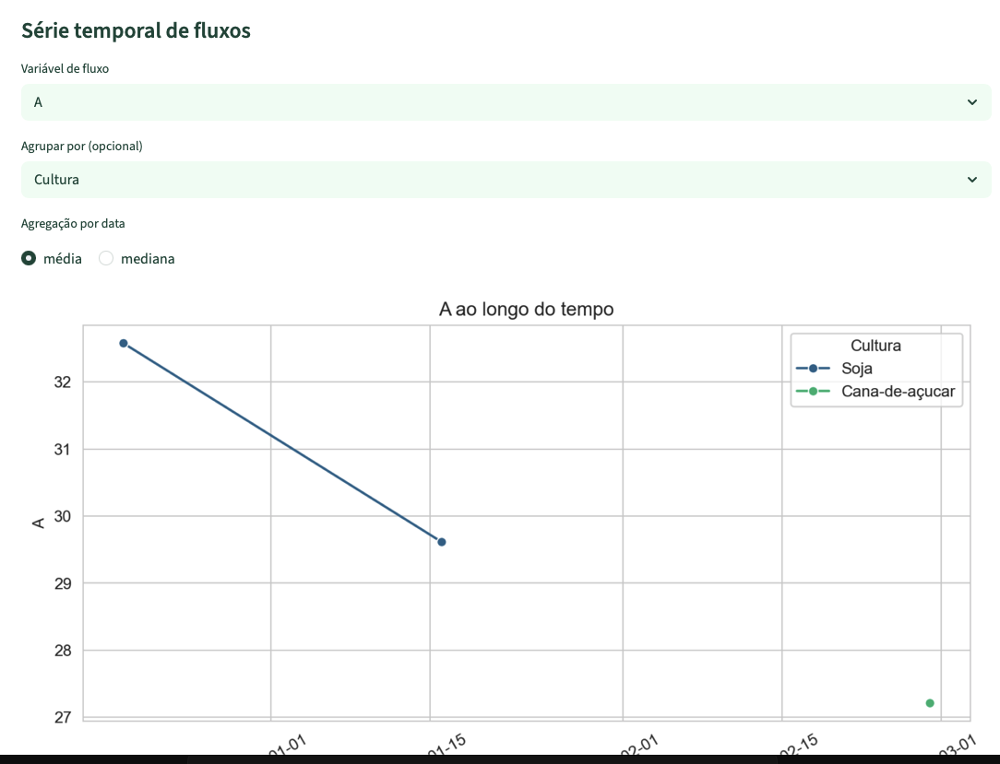

| Condición | Qué ocurre |
|---|---|
| Menos de **10 fechas con medición real** | La STL se bloquea con aviso: *"Solo N fechas con medición real (mínimo 10). La descomposición STL exige puntos suficientes — las campañas puntuales no cumplen el requisito."* |
| La interpolación cubre **más del 70 %** de la serie | La STL se ejecuta, pero con aviso destacado: las métricas de fuerza de tendencia/estacionalidad reflejan en gran parte la propia interpolación, no la señal observada. |

> **En el dataset Rio Verde:** solo 3 fechas distintas (Dic/2025, Ene/2026, Feb/2026) → la app bloquea la STL con un mensaje claro. Este es el comportamiento correcto; la descomposición necesitaría campañas mensuales (~12 fechas) o semanales (~10+) para ser estadísticamente honesta.

#### Salida cuando la STL se ejecuta

Cuando hay datos suficientes, la página produce cuatro gráficos apilados (Observado, Tendencia, Estacionalidad, Residuo) y tres métricas:

* **Fuerza de tendencia** — `1 − Var(residuo) / Var(observado − estacional)`. Próximo a 1 = tendencia muy clara.
* **Fuerza de estacionalidad** — `1 − Var(residuo) / Var(observado − tendencia)`. Próximo a 1 = estacionalidad muy clara.
* **n** — número de puntos de la serie tras agregación/interpolación.

---

## 11. Comparación por grupos

> Página **Comparación por grupo** en el menú lateral.

Esta página implementa el caso de uso clásico **"¿el Grupo A difiere del Grupo B?"** con herramientas estadísticas robustas. A diferencia de la pestaña Boxplot del EDA (§6.4), aquí usted tiene:

* **Definición flexible de los grupos** — elección manual de qué valores entran en A y B, o pattern matching por substring.
* **Prueba estadística formal** — Mann-Whitney U *two-sided* para cada variable.
* **Regresión log-lineal por grupo** — ajusta la relación log(Y) ~ X por separado en A y B.
* **Patrón horario** — agrega Y por hora del día para cada grupo (útil para flujos diurnos vs. nocturnos).

### 11.1 Configuración de los grupos

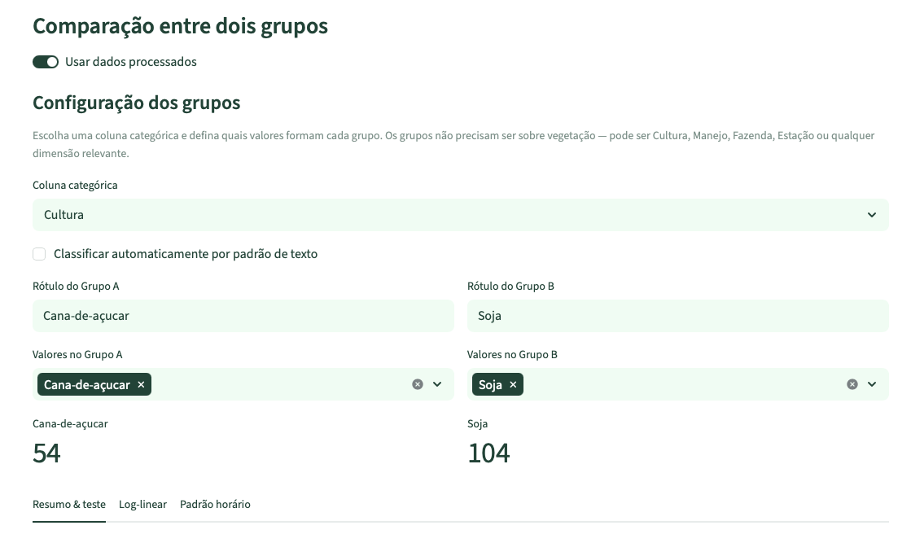

**Columna categórica** — selectbox en la parte superior. Define qué columna será particionada en dos grupos. Predeterminado: `Cultura`.

**Dos vías de definir A y B:**

#### Modo manual (predeterminado)

Dos multiselects, lado a lado:

* **Valores en el Grupo A** + etiqueta personalizable (predeterminado: primer valor de la columna).
* **Valores en el Grupo B** + etiqueta personalizable (predeterminado: el segundo valor).

Puede asignar múltiples valores a un mismo grupo (ej.: agrupar "R1", "R2", "R3" en un solo "Estadio reproductivo temprano").

> **Validación automática:** si algún valor aparece en ambos lados, la app muestra `st.error` e impide el avance.

#### Modo pattern matching

Marque el checkbox **Clasificar automáticamente por patrón de texto**. Aparece un campo de texto donde escribe un patrón (case-insensitive):

* Valores que **contienen** el patrón → Grupo A (Match).
* Valores que **no contienen** → Grupo B (Other).

Útil cuando la columna tiene muchos niveles (ej.: 14 estadios fenológicos) y quiere separar rápidamente "todo lo que contiene 'maduración'" del resto. La app muestra la lista de cada grupo en una nota para que la verifique antes de analizar.

#### Métricas de N por grupo

Tras la configuración, dos métricas grandes muestran cuántas filas cayeron en cada grupo:

> **En el dataset Rio Verde (modo Desplegar):** Caña de azúcar = 54, Soja = 104. En modo Media sería 27 vs. 54 — siga atento al número porque gobierna el poder estadístico de las pruebas que vienen a continuación.

### 11.2 Resumen y prueba — Mann-Whitney U

> Primera pestaña dentro de la Comparativa.

Para cada variable numérica seleccionada, devuelve dos bloques:

**Tabla de resumen descriptivo** (`group`, `variable`, `n`, `mean`, `se`, `median`):

**Tabla de prueba de Mann-Whitney U:**

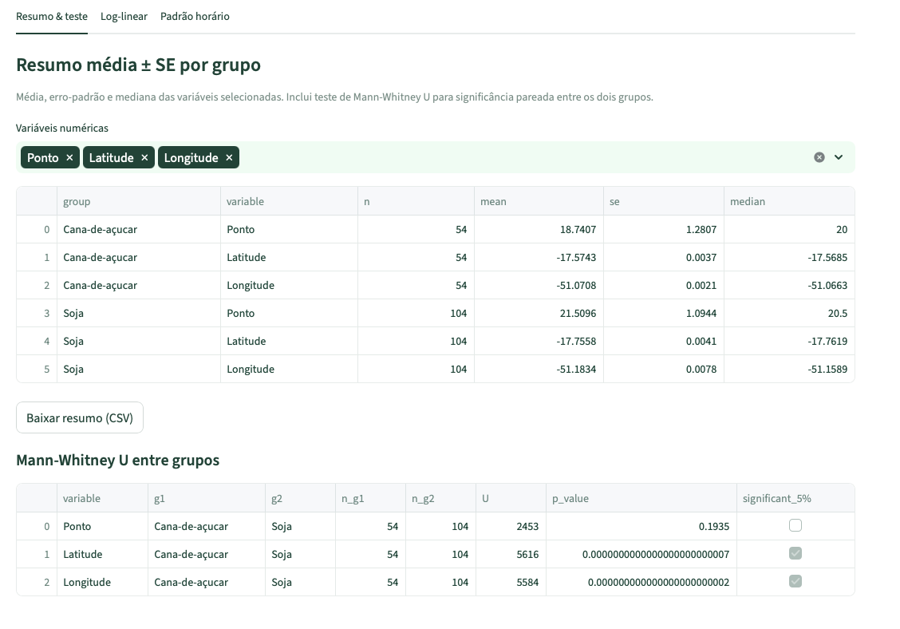

| Columna | Significado |
|---|---|
| `variable` | La variable probada. |
| `g1`, `g2` | Etiquetas de los grupos. |
| `n_g1`, `n_g2` | Tamaño de cada grupo. |
| `U` | Estadística de Mann-Whitney. |
| `p_value` | Probabilidad bajo H₀ (misma distribución). |
| `significant_5%` | `True` si p < 0,05. |

#### Cuándo es apropiado el Mann-Whitney

| Condición | Implicación |
|---|---|
| Los dos grupos tienen forma de distribución **similar** | Mann-Whitney compara medianas (interpretación directa). |
| Las distribuciones tienen formas **diferentes** | Mann-Whitney compara distribuciones globales (el rechazo no significa "mediana diferente", sino "distribución diferente"). |
| Hay **pseudoreplicación** (réplicas en el mismo sitio) | n inflado → p artificialmente pequeño. Considere agregar por sitio (modo de réplica Media o Mediana) antes de comparar. |

> **En el dataset Rio Verde:** ejecutando Caña vs. Soja en Latitud y Longitud, los valores-p son del orden de 10⁻⁸ — lo que **no** significa que la caña y la soja tienen "latitudes diferentes" en sentido fisiológico. Significa que **las dos fincas están en lugares geográficamente distintos** y cada una tiene solo un cultivo (recuerde el confundimiento Fazenda ⟷ Cultura). Para un hallazgo biológicamente significativo, pruebe variables fisiológicas (`A`, `gs`, `E`, etc.) y léalo en conjunto con la pestaña de Confundimiento (§6.2).

### 11.3 Log-lineal por grupo

> Segunda pestaña dentro de la Comparativa.

Ajusta una regresión lineal simple en escala **log(Y)** versus X, **por separado para cada grupo**. Útil cuando la relación Y-X es exponencial o multiplicativa (saturación, decaimiento).

**Configuraciones:**

* **Variable Y** (numérica) — solo valores **estrictamente positivos** entran (log(0) y log negativo se descartan silenciosamente).
* **Variable X** (numérica).

Salida: scatter coloreado por grupo + rectas ajustadas + tabla con `intercept`, `slope`, `R²`, `p_value`, `se_slope` por grupo.

> **Cuidado cuando Y tiene valores ≤ 0:** la app descarta esas filas antes del log. Si un grupo tiene muchos negativos (caso de FCO2_DRY en uptake, FCH4_DRY en sumidero), usted compara N drásticamente diferentes entre los grupos, **comprometiendo la comparabilidad**. Verifique siempre el `n` reportado en cada grupo en el gráfico.

### 11.4 Patrón horario

> Tercera pestaña dentro de la Comparativa.

Para datasets con columna de **fecha/hora** (no apenas fecha), extrae la hora de cada medición y calcula la media/mediana de Y por hora-del-día, por separado para cada grupo.

Salida: dos gráficos lado a lado:

* **Izquierda:** media (o mediana) por hora, una línea por grupo.
* **Derecha:** suma acumulada por hora — útil para visualizar el flujo acumulado a lo largo del día (ej.: emisión de CO₂ diurna).

Tabla exportable como CSV.

> **En el dataset Rio Verde:** la columna `Data da coleta` tiene solo la parte de fecha (sin hora), entonces todas las mediciones caen en la hora `00:00`. La pestaña queda visualmente vacía, excepto por la barra única en cero. En datasets de flujo de suelo con timestamp completo (IRGA midiendo cada 1-2 horas) la pestaña es mucho más útil.

---

## 12. Estadística Experimental (diseños)

> Página **Estadística Experimental** en el menú lateral.

Esta página es una herramienta **genérica** de análisis de diseños experimentales — funciona con cualquier dataset (del proyecto o de terceros), no solo fisiología. Usted mapea las columnas a *roles* (respuesta, tratamiento, bloque, factores) y la herramienta infiere el diseño, ajusta el ANOVA, prueba los supuestos y compara las medias. Está inspirada en el flujo de *Estatística Experimental no Rbio* (Bhering & Teodoro).

> **Validación:** los análisis fueron verificados **número a número contra R** (`aov`, `car::Anova` tipo II, `emmeans`, paquete `ScottKnott`). Vea `docs/validacao_externa.md`.

La página tiene tres modos (selector arriba):

### 12.1 Modo Diseño (ANOVA)

Mapee las columnas:

* **Variable-respuesta** — numérica (ej.: productividad, `A`).
* **Tratamiento** — factor principal (categórico). Las columnas numéricas de baja cardinalidad pueden promoverse a factor en *"Tratar como factor"*.
* **Bloque / repetición** (opcional) → diseño en bloques.
* **2º y 3º factor** (opcionales) → esquema factorial con interacciones.
* **Covariable** (opcional, numérica) → ANCOVA (medias ajustadas).

El **diseño se detecta automáticamente**:

| Columnas mapeadas | Diseño |
|---|---|
| Tratamiento | **DCA** (diseño completamente al azar) |
| Tratamiento + bloque | **DBCA** (diseño en bloques completos al azar) |
| Tratamiento + 2º (y 3º) factor | **Factorial** (con interacciones) |
| Tratamiento + fila + columna | **Cuadrado Latino** |

**Diseños de error compuesto** (expander propio, con prioridad): **parcelas subdivididas** (split-plot), **franjas** (strip-plot) y **jerárquico** (nested) — cada uno con sus múltiples términos de error y pruebas F con el denominador correcto.

Cuatro pestañas de resultado:

1. **ANOVA** — cuadro completo (gl, SC, CM, F, valor-p), **CV% experimental** e interpretación automática de los términos.
2. **Supuestos** — Shapiro-Wilk (normalidad de los residuos) y Levene (homocedasticidad), con QQ-plot y gráfico de residuos × ajustados.
3. **Comparación de medias** — elección del método: **Tukey, Scott-Knott, Duncan, Scheffé, LSD/DMS** (con letras de significancia y gráfico de barras), o **Dunnett** (cada tratamiento vs. un control). En ANCOVA, las medias se ajustan por la covariable.
4. **Reproducibilidad** — fragmento del código + botón para **descargar el script Python** completo que reproduce el análisis, además del CSV de los datos.


### 12.2 Modo Regresión de dosis

Para un factor **cuantitativo** (dosis de fertilizante, lámina de riego, densidad…): ajuste polinomial (lineal, cuadrático o cúbico) con R², R² ajustado, significancia del término de mayor grado y gráfico observado + curva ajustada.

### 12.3 Modo Correlación

Matriz de correlación de **Pearson** o **Spearman** (heatmap + valores-p), con descarga, y **correlación parcial** (controlando por covariables).

---

## 13. Glosario estadístico

Definiciones cortas de los términos técnicos usados en el manual. Para profundizar, vea las Referencias (§15).

* **Anderson-Darling** — prueba de normalidad sensible a desviaciones en las colas. Devuelve la estadística A² y el valor crítico al 5 %; rechaza si A² > crítico.
* **V de Cramér** — medida de asociación entre dos variables categóricas, en el intervalo [0, 1]. V=1 indica equivalencia perfecta; usada en la app para detectar confundimiento.
* **D'Agostino-Pearson (K²)** — prueba de normalidad que combina asimetría y curtosis. Robusta a empates; recomendada para n moderado.
* **Elliptic Envelope** — método de detección de outliers que asume **normalidad multivariada**. Poco confiable en datos bimodales o fuertemente asimétricos.
* **Getis-Ord Gi*** — estadística local que clasifica cada punto como hotspot (cluster de altos), coldspot (cluster de bajos) o no significativo, con base en su vecindad vía banda de distancia.
* **GroupKFold** — variante de validación cruzada que mantiene todas las filas de un mismo "grupo" (sitio, finca, punto) en el mismo fold. Evita inflar el R² cuando hay pseudoreplicación.
* **IDW (Inverse Distance Weighting)** — interpolación determinística que estima cada punto del grid como media ponderada de los puntos muestreados, con peso ∝ 1/distancia^power.
* **Isolation Forest** — algoritmo de detección de outliers basado en árboles aleatorios. No paramétrico, escala bien para muchas dimensiones.
* **Kruskal-Wallis (KW)** — prueba no paramétrica que compara distribuciones entre 2 o más grupos. Equivale al Mann-Whitney cuando hay exactamente 2 grupos.
* **Kriging ordinario** — interpolación **estadística** basada en la estructura espacial de los datos, ajustada vía variograma. Devuelve estimaciones + incertidumbre.
* **LISA (Local Indicators of Spatial Association)** — versión local del Moran's I; clasifica cada punto en HH, HL, LH, LL o NS según su valor y el de su vecindad.
* **LOF (Local Outlier Factor)** — método de outliers basado en densidad local. Marca puntos cuya vecindad es menos densa que la de sus vecinos.
* **Mann-Whitney U** — prueba no paramétrica para comparar dos muestras independientes. Equivalente al Kruskal-Wallis con k=2.
* **Moran's I** — índice de autocorrelación espacial global, en el intervalo [-1, +1]. Positivo → valores similares se agrupan en el espacio.
* **Pearson (r)** — coeficiente de correlación lineal. Sensible a outliers; presupone relación lineal.
* **Pseudoreplicación** — cuando las réplicas (mediciones) del mismo sitio se tratan como observaciones independientes. Infla el n efectivo y genera valores-p optimistas.
* **Q-Q plot** — gráfico que compara los cuantiles muestrales con los teóricos de la normal. Los puntos alineados en la diagonal indican normalidad visual.
* **Shapiro-Wilk (W)** — prueba de normalidad. La más sensible para n < 5000; estándar en la literatura.
* **Spearman (ρ)** — coeficiente de correlación por rangos. Robusto a outliers y capta relaciones monotónicas no lineales.
* **STL (Seasonal-Trend decomposition using LOESS)** — descompone una serie temporal en tendencia, estacionalidad y residuo vía regresión local robusta.
* **UTM (Universal Transverse Mercator)** — sistema de proyección cartográfica en metros. Rio Verde, GO queda en el huso 22 Sur (EPSG 32722).
* **Variograma** — función que describe la semivarianza entre pares de puntos en función de la distancia. Parámetros: nugget (varianza en h=0), sill (asíntota) y range (distancia en la que se estabiliza).
* **VIF (Variance Inflation Factor)** — mide la multicolinealidad. VIF=1/(1-R²) donde R² proviene de la regresión de la variable contra todas las demás. VIF ≥ 10 indica colinealidad severa.
* **Z-score** — número de desviaciones estándar por encima/debajo de la media. El criterio |z|>3 marca outliers; **no robusto** (el propio outlier infla la desviación estándar).

---

## 14. Solución de problemas (FAQ)

### "Aparece `sidebar.rep.media` (u otra clave cruda) en lugar del texto traducido"

Streamlit cachea el módulo de traducciones en el primer import. Si actualizó la app después de que el servidor ya estaba en ejecución, las nuevas claves no aparecen hasta reiniciar. **Solución:** `Ctrl+C` en la terminal y `python -m streamlit run app.py` de nuevo.

### "El pipeline vació mi dataset (o eliminó casi todo)"

Vaya a **Pipeline y Procesamiento** y lea el aviso amarillo destacado. La causa casi siempre es la etapa 2 — una de las columnas obligatorias (`Cultura`, `Uso atual` o `Época`) está vacía en muchas filas. Vuelva a Excel, identifique qué columna está faltando, y rehaga la carga con la planilla corregida.

### "La página Serie Temporal dice 'Columna de fecha no encontrada'"

Verifique en Excel si su columna se llama `Data da coleta`, `Data`, `Date`, `DATE_TIME initial_value` o alguna variante reconocida (lista completa en [`docs/data_dictionary.md`](data_dictionary.md)). Si el nombre está correcto, abra la columna y verifique si las celdas están como **fechas reales** (Excel las muestra `2025-12-19` a la derecha) y no como **texto** ("2025-12-19" a la izquierda). Guarde el archivo y recargue.

### "GroupKFold redujo mis folds automáticamente"

Significa que el número de grupos únicos en la columna elegida es menor que el número de folds que configuró. Por ejemplo: pidió 5 folds, pero solo hay 4 fincas — la app ajusta a 4 folds. Si quiere mantener los 5 folds, elija una columna de agrupamiento con más niveles (ej.: `Fazenda + Ponto` en vez de solo `Fazenda`).

### "Algunas variables aparecen con VIF infinito o astronómico"

Esto es esperado para **variables derivadas matemáticamente** de otras: `Ci/Ca` es Ci dividido por Ca (con Ca casi constante, se vuelve un reescalado de Ci); `EUA = A/E`; `A/Ci` es una razón; `ETR` es función de YII. Un VIF alto entre esas indica multicolinealidad **por construcción**, no por problema de los datos. Incluya solo una representante del par derivado en los modelos.

### "Moran's I dio 0,9 — ¿mis datos están extremadamente agregados espacialmente?"

Antes de celebrar el descubrimiento de un cluster, verifique la pestaña **Calidad del EDA → Confundimiento entre categorías**. Si `Fazenda ⟷ Cultura` (o similar) aparece como redundante, el Moran's I está captando **diferencia biológica entre cultivos** más que autocorrelación espacial verdadera. Rehaga el Moran filtrando para un único cultivo vía filtro global, y vea si el índice permanece alto.

### "El variograma de kriging no se estabiliza"

Probablemente su dataset no tiene **estructura espacial detectable** en la escala del experimento (pocos puntos muestrales, o variable dominada por otros factores que no la posición). No ejecute el kriging en esa situación — los parámetros ajustados (range en millones de metros) son numéricamente válidos pero estadísticamente inútiles. Considere volver al IDW (§9.1) o revisar la recolección.

### "Los modos de réplica `Réplica 1`, `Réplica 2` y `Réplica 3` parecen dar resultados diferentes para Chl a y b"

Son diferentes de verdad — cada uno toma una medición específica de la planilla. `Réplica 1` usa la columna `Chl a` original; `Réplica 2` usa `Chl a.1`. **La Réplica 3 deja Chl a/b vacíos** (solo existe `IAF.2`, no `Chl a.2`). Use estos modos cuando quiera auditar/comparar lecturas específicas; para análisis normal, use **Media** o **Mediana**.

---

## 15. Referencias

### Métodos estadísticos

* Anderson, T. W., & Darling, D. A. (1952). Asymptotic theory of certain "goodness of fit" criteria based on stochastic processes. *Annals of Mathematical Statistics*, 23(2), 193-212.
* Bergsma, W., & Wicher, M. (2013). A bias-correction for Cramér's V and Tschuprow's T. *Journal of the Korean Statistical Society*, 42(3), 323-328.
* Cleveland, R. B., Cleveland, W. S., McRae, J. E., & Terpenning, I. (1990). STL: A seasonal-trend decomposition procedure based on loess. *Journal of Official Statistics*, 6(1), 3-73.
* D'Agostino, R. B., Belanger, A., & D'Agostino Jr., R. B. (1990). A suggestion for using powerful and informative tests of normality. *American Statistician*, 44(4), 316-321.
* Getis, A., & Ord, J. K. (1992). The analysis of spatial association by use of distance statistics. *Geographical Analysis*, 24(3), 189-206.
* Kruskal, W. H., & Wallis, W. A. (1952). Use of ranks in one-criterion variance analysis. *JASA*, 47(260), 583-621.
* Mann, H. B., & Whitney, D. R. (1947). On a test of whether one of two random variables is stochastically larger than the other. *Annals of Mathematical Statistics*, 18(1), 50-60.
* Moran, P. A. P. (1948). The interpretation of statistical maps. *Journal of the Royal Statistical Society, Series B*, 10(2), 243-251.
* Shapiro, S. S., & Wilk, M. B. (1965). An analysis of variance test for normality. *Biometrika*, 52(3-4), 591-611.

### Outliers y modelado

* Breunig, M. M., Kriegel, H. P., Ng, R. T., & Sander, J. (2000). LOF: Identifying density-based local outliers. *SIGMOD Record*, 29(2), 93-104.
* Liu, F. T., Ting, K. M., & Zhou, Z. H. (2008). Isolation forest. *ICDM*, 413-422.
* Rousseeuw, P. J., & van Driessen, K. (1999). A fast algorithm for the minimum covariance determinant estimator. *Technometrics*, 41(3), 212-223.

### Fisiología vegetal

* Farquhar, G. D., von Caemmerer, S., & Berry, J. A. (1980). A biochemical model of photosynthetic CO₂ assimilation in leaves of C3 species. *Planta*, 149(1), 78-90.

### Bibliotecas

* McKinney, W. (2010). pandas — Data analysis with Python. <https://pandas.pydata.org>
* Pedregosa, F. et al. (2011). Scikit-learn: Machine learning in Python. *JMLR*, 12, 2825-2830.
* Rey, S. J., & Anselin, L. (2010). PySAL: A Python library of spatial analytical methods. <https://pysal.org>
* Seabold, S., & Perktold, J. (2010). statsmodels: Econometric and statistical modeling. <https://www.statsmodels.org>
* Streamlit Inc. (2024). Streamlit. <https://streamlit.io>
* Virtanen, P. et al. (2020). SciPy 1.0. *Nature Methods*, 17, 261-272.

## 16. Contribuyendo

¿Encontró un bug, tiene una sugerencia de mejora o quiere agregar un análisis nuevo?

### 16.1 Reportando bugs y proponiendo features

Abra una issue en el repositorio del proyecto en GitHub. Incluya:

1. **Versión de la app** (verifique en el pie de página o en el `pyproject.toml`).
2. **Pasos para reproducir** — comience siempre por "fui a la pestaña X, hice clic en Y, esperaba Z pero vi W".
3. **Captura de pantalla** (si es un problema visual).
4. **Fragmento del dataset** (anonimizado) que dispara el problema, siempre que sea posible.

### 16.2 Contribuyendo con código

* Vea [`docs/contributing.md`](contributing.md) para el flujo de PRs y los estándares de prueba.
* Vea [`docs/architecture.md`](architecture.md) para entender el layout de los módulos.
* Vea [`docs/i18n.md`](i18n.md) para agregar un nuevo idioma o extender las traducciones.

### 16.3 Generando este manual en PDF

La fuente canónica de este manual es el archivo Markdown que está leyendo (`docs/manual.pt.md`). El PDF es un derivado, generado por [pandoc](https://pandoc.org/) + XeLaTeX.

#### Localmente

```bash
# 1) Pre-requisitos (una vez por máquina)
brew install pandoc                       # macOS
brew install --cask basictex
sudo tlmgr install fancyhdr xurl booktabs longtable

# Ubuntu equivalente:
# sudo apt-get install pandoc texlive-xetex \
#   texlive-fonts-recommended texlive-latex-recommended

# 2) Generar el PDF
scripts/build_manual_pdf.sh                       # → docs/manual.pt.pdf
scripts/build_manual_pdf.sh --lang es             # genera docs/manual.es.pdf
scripts/build_manual_pdf.sh --output /tmp/x.pdf   # ruta personalizada
```

El PDF se genera en `docs/manual.<lang>.pdf` y el `.gitignore` impide que se commitee por accidente.

#### Vía GitHub Actions

El workflow [`build-manual.yml`](../.github/workflows/build-manual.yml) genera el PDF automáticamente:

* **Push a tag `v*`** — adjunta el PDF como artifact de la release correspondiente.
* **Cambios en `docs/manual.*.md`** o en las capturas de pantalla — ejecuta el build para validar que nada se rompió.
* **Ejecución manual** — vaya a *Actions → Build manual PDF → Run workflow* y elija el idioma.

Los artifacts quedan disponibles por 30 días y pueden descargarse sin necesidad de instalar pandoc localmente.

### 16.4 Traduciendo a otros idiomas

El esqueleto de este manual está listo para recibir espejos en inglés y español:

```bash
cp docs/manual.pt.md docs/manual.en.md
cp docs/manual.pt.md docs/manual.es.md
```

Traduzca el contenido manteniendo la estructura de encabezados. Las imágenes en `docs/img/manual/` se comparten entre los tres idiomas — solo necesita una copia.

---

*Fin del manual. Versión 1.0 — alineada con la versión 1.x de la aplicación.*
